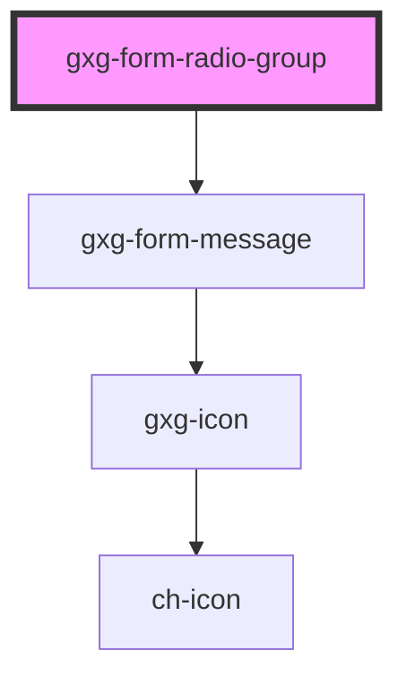

# gxg-form-radio-group

<!-- Auto Generated Below -->

## Properties

| Property          | Attribute          | Description                                                                                                                                                    | Type      | Default     |
| ----------------- | ------------------ | -------------------------------------------------------------------------------------------------------------------------------------------------------------- | --------- | ----------- |
| `label`           | `label`            | The radio group label                                                                                                                                          | `string`  | `undefined` |
| `required`        | `required`         | Make the radio-buttons required                                                                                                                                | `boolean` | `false`     |
| `requiredMessage` | `required-message` | The required message if this input is required and no value is provided (optional). If this is not provided, the default browser required message will show up | `string`  | `undefined` |

## Dependencies

### Depends on

- [gxg-form-message](../form-message)

### Graph

---

_Built with [StencilJS](https://stenciljs.com/)_
