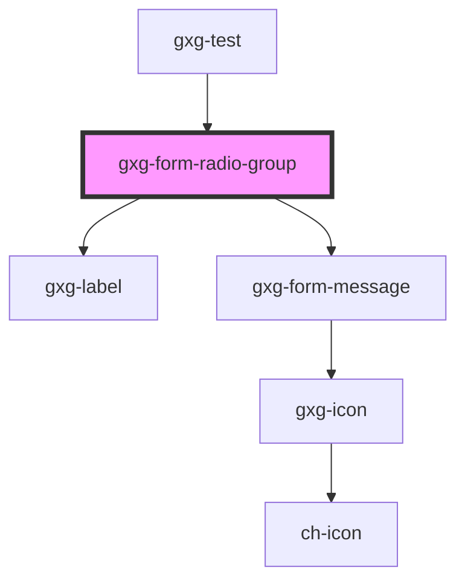

# gxg-form-radio-group

<!-- Auto Generated Below -->

## Properties

| Property            | Attribute            | Description                                                                                                                                                    | Type      | Default     |
| ------------------- | -------------------- | -------------------------------------------------------------------------------------------------------------------------------------------------------------- | --------- | ----------- |
| `label`             | `label`              | The radio group label                                                                                                                                          | `string`  | `undefined` |
| `required`          | `required`           | Make the radio-buttons required                                                                                                                                | `boolean` | `false`     |
| `row`               | `row`                | The presence of this attribute makes the radios be displayed with flex "row", instead of flex "column"                                                         | `boolean` | `undefined` |
| `validationMessage` | `validation-message` | The required message if this input is required and no value is provided (optional). If this is not provided, the default browser required message will show up | `string`  | `undefined` |
| `value`             | `value`              | The radio group checked radio value                                                                                                                            | `string`  | `undefined` |

## Dependencies

### Used by

- [gxg-test](../test)

### Depends on

- [gxg-label](../label)
- [gxg-form-message](../form-message)

### Graph

---

_Built with [StencilJS](https://stenciljs.com/)_
