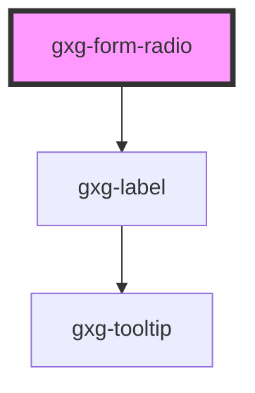

# gxg-form-radio-group

<h2>Notes</h2>
<ul>
    <li>Wrap all the <code>gxg-form-radio</code> inputs with a <code>gxg-form-radio-group</code>.</li>
    <li>You can optionally set a title to the radio group, by providing a value to the <code>label</code> attribute</li>
    <li>Provide an id to each <code>gxg-radio</code>. This is mandatory in order for the component to work.</li>
</ul>

## Properties

| Property | Attribute | Description           | Type     | Default     |
| -------- | --------- | --------------------- | -------- | ----------- |
| `label`  | `label`   | The radio group label | `string` | `undefined` |

# gxg-form-radio

<!-- Auto Generated Below -->

## Properties

| Property   | Attribute  | Description                                                                 | Type      | Default     |
| ---------- | ---------- | --------------------------------------------------------------------------- | --------- | ----------- |
| `checked`  | `checked`  | The presence of this attribute makes the radio selected by default          | `boolean` | `false`     |
| `disabled` | `disabled` | The presence of this attribute disables the radio                           | `boolean` | `false`     |
| `error`    | `error`    | Styles the radio-button with error attributes                               | `boolean` | `false`     |
| `label`    | `label`    | The radio label                                                             | `string`  | `undefined` |
| `name`     | `name`     | The radio name (should be the same for every radio of the same radio-group) | `string`  | `undefined` |
| `radioId`  | `radio-id` | The radio id                                                                | `string`  | `undefined` |
| `value`    | `value`    | The radio value                                                             | `string`  | `undefined` |

## Events

| Event          | Description                                          | Type                                           |
| -------------- | ---------------------------------------------------- | ---------------------------------------------- |
| `keyPressed`   | (This event is for internal use)                     | `CustomEvent<any>`                             |
| `radioChecked` | Emits the id and value of the radio when is checked. | `CustomEvent<{ value: string; id?: string; }>` |

## Dependencies

### Depends on

- [gxg-label](../label)

### Graph

---

_Built with [StencilJS](https://stenciljs.com/)_
