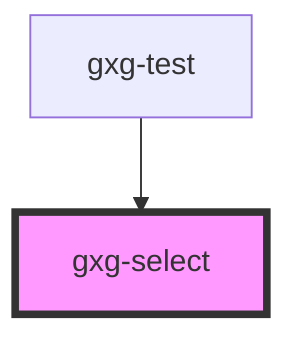

# gxg-option

## Properties

| Property   | Attribute  | Description                                                         | Type      | Default     |
| ---------- | ---------- | ------------------------------------------------------------------- | --------- | ----------- |
| `selected` | `selected` | The presence of this attribute makes the option selected by default | `boolean` | `undefined` |
| `value`    | `value`    | The value                                                           | `string`  | `undefined` |

# gxg-form-select

<h2>Using a gxg-select</h2>
<ol>
   <li>Insert a <code>gxg-select</code> element</li>
   <li>Insert insde the <code>gxg-select</code>, any number of options by using the <code>gxg-form-option</code> element</li>
   <li>Set the <code>value</code> attribute for each <code>gxg-option</code>, and provide the <code>selected</code> attribute for the option you want to be selected by default</li>
</ol>

<!-- Auto Generated Below -->

## Usage

### Usage

```
   <gxg-select
    label="Select a car:"
    label-position="above"
    max-width="240px"
    size="5"
    id="gxg-select"
  >
    <gxg-option value="0">Select car:</gxg-option>
    <gxg-option value="1">Audi</gxg-option>
    <gxg-option value="2">BMW</gxg-option>
    <gxg-option value="3">Citroen</gxg-option>
    <gxg-option value="4">Ford</gxg-option>
    <gxg-option value="5">Honda</gxg-option>
    <gxg-option value="6">Jaguar</gxg-option>
    <gxg-option value="7">Land Rover</gxg-option>
    <gxg-option value="8">Mercedes</gxg-option>
  </gxg-select>
  <br>
  <gxg-button id="btn-show-errors">Show errors</gxg-button>
  <script>
      const btnShowErrors = document.getElementById("btn-show-errors");
      btnShowErrors.addEventListener("click", function(){
      const gxgSelect = document.getElementById("gxg-select");
      const gxgFormMessage = document.createElement("gxg-form-message");
      gxgFormMessage.innerHTML = "You have to select a car";
      gxgFormMessage.setAttribute("type", "error");
      gxgFormMessage.setAttribute("slot", "message");
      gxgSelect.setAttribute("error",true);
      gxgSelect.appendChild(gxgFormMessage);
    });
  </script>
```

## Properties

| Property        | Attribute        | Description                                                                                                           | Type                 | Default     |
| --------------- | ---------------- | --------------------------------------------------------------------------------------------------------------------- | -------------------- | ----------- |
| `disabled`      | `disabled`       | The presence of this attribute disables the component                                                                 | `boolean`            | `false`     |
| `error`         | `error`          | The presence of this attribute stylizes the component with error attributes                                           | `boolean`            | `false`     |
| `initialValue`  | `initial-value`  | This holds the value of the initial selected option                                                                   | `string`             | `undefined` |
| `label`         | `label`          | The select label                                                                                                      | `string`             | `undefined` |
| `labelPosition` | `label-position` | The input label                                                                                                       | `"above" \| "start"` | `"above"`   |
| `maxWidth`      | `max-width`      | The select max. width                                                                                                 | `string`             | `"100%"`    |
| `minimal`       | `minimal`        | The presence of this attribute hides the border, and sets the background to transparent when the element has no focus | `boolean`            | `true`      |
| `required`      | `required`       | The presence of this attribute makes this input required                                                              | `boolean`            | `false`     |
| `size`          | `size`           | The maximum number of visible options                                                                                 | `string`             | `undefined` |
| `value`         | `value`          | This holds the value of the selected option                                                                           | `string`             | `undefined` |
| `warning`       | `warning`        | The presence of this attribute stylizes the component with warning attributes                                         | `boolean`            | `false`     |

## Events

| Event    | Description                              | Type               |
| -------- | ---------------------------------------- | ------------------ |
| `change` | Returns the value of the selected option | `CustomEvent<any>` |

## Methods

### `isOpen() => Promise<boolean>`

#### Returns

Type: `Promise<boolean>`

## Dependencies

### Used by

- [gxg-test](../test)

### Graph



---

_Built with [StencilJS](https://stenciljs.com/)_
