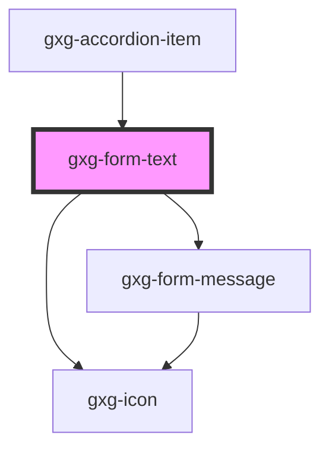

# gxg-form-text

<!-- Auto Generated Below -->

## Properties

| Property          | Attribute          | Description                                                                                                                                                    | Type                                                                                         | Default     |
| ----------------- | ------------------ | -------------------------------------------------------------------------------------------------------------------------------------------------------------- | -------------------------------------------------------------------------------------------- | ----------- |
| `clearButton`     | `clear-button`     | The presence of this attribute displays a clear (cross) button-icon on the right side                                                                          | `boolean`                                                                                    | `false`     |
| `disabled`        | `disabled`         | The presence of this attribute makes the input disabled                                                                                                        | `boolean`                                                                                    | `false`     |
| `error`           | `error`            | The presence of this attribute gives the component error styles                                                                                                | `boolean`                                                                                    | `false`     |
| `icon`            | `icon`             | The input icon (optional)                                                                                                                                      | `any`                                                                                        | `null`      |
| `iconPosition`    | `icon-position`    | The input icon side                                                                                                                                            | `"end" \| "start"`                                                                           | `null`      |
| `label`           | `label`            | The input label                                                                                                                                                | `string`                                                                                     | `undefined` |
| `maxWidth`        | `max-width`        | The input max. width                                                                                                                                           | `string`                                                                                     | `"100%"`    |
| `minimal`         | `minimal`          | The presence of this attribute hides the border, and sets the background to transparent when the element has no focus                                          | `boolean`                                                                                    | `false`     |
| `placeholder`     | `placeholder`      | The input placeholder                                                                                                                                          | `string`                                                                                     | `undefined` |
| `required`        | `required`         | The presence of this attribute makes this input required                                                                                                       | `boolean`                                                                                    | `false`     |
| `requiredMessage` | `required-message` | The required message if this input is required and no value is provided (optional). If this is not provided, the default browser required message will show up | `string`                                                                                     | `undefined` |
| `textStyle`       | `text-style`       | The text style                                                                                                                                                 | `"quote" \| "regular" \| "title-01" \| "title-02" \| "title-03" \| "title-04" \| "title-05"` | `"regular"` |
| `value`           | `value`            | The input value                                                                                                                                                | `string`                                                                                     | `undefined` |
| `warning`         | `warning`          | The presence of this attribute gives the component warning styles                                                                                              | `boolean`                                                                                    | `false`     |

## Events

| Event                | Description                  | Type               |
| -------------------- | ---------------------------- | ------------------ |
| `change`             | Returns the input value      | `CustomEvent<any>` |
| `clearButtonClicked` | The clear button was clicked | `CustomEvent<any>` |
| `input`              | Returns the input value      | `CustomEvent<any>` |

## Shadow Parts

| Part      | Description |
| --------- | ----------- |
| `"input"` |             |

## Dependencies

### Used by

- [gxg-accordion-item](../accordion-item)

### Depends on

- [gxg-icon](../icon)
- [gxg-form-message](../form-message)

### Graph

---

_Built with [StencilJS](https://stenciljs.com/)_
