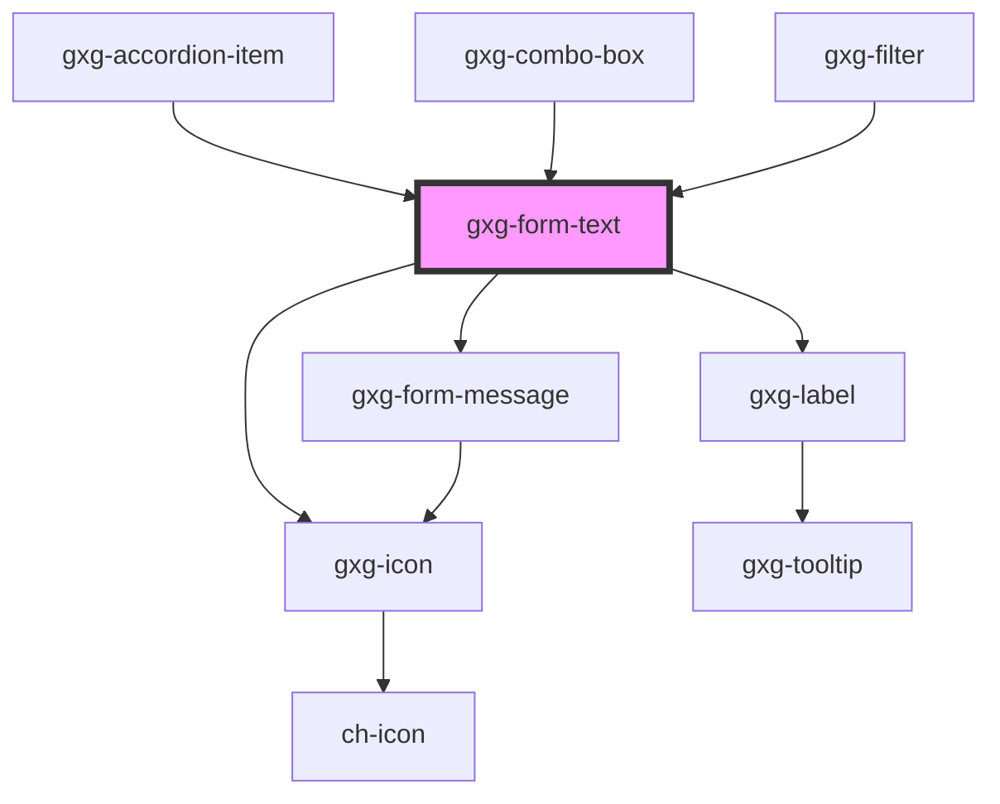

# gxg-form-text

<h2>Adding custom error or warning messages</h2>
<ul><li>To add an <em>error message</em>, append the following to the <code>gxg-form-text</code> : 
  <pre><code>
      let gxgFromText = document.getElementById("gxg-form-text");
      let errorMessage = document.createElement("gxg-form-message");
      errorMessage.setAttribute("type", "error");
      errorMessage.setAttribute("slot", "message");
      errorMessage.textContent = "this is an error message";
      gxgFromText.appendChild(errorMessage);
  </code></pre>
 </li>
<li>To add a <em>warning message</em>, do the same but change the <code>type</code> attribute to <code>warning</code>:
  <pre><code>
      let gxgFromText = document.getElementById("gxg-form-text");
      let warningMessage = document.createElement("gxg-form-message");
      warningMessage.setAttribute("type", "warning");
      warningMessage.setAttribute("slot", "message");
      warningMessage.textContent = "this is a warning message";
      gxgFromText.appendChild(warningMessage);
  </code></pre> </li>
</ul>

<!-- Auto Generated Below -->

## Usage

### Usage

```
  <gxg-form-text label="Full name" label-position="top" placeholder="John Smith" id="gxg-form-text" max-width="240px"></gxg-form-text>
  <br>
  <gxg-button id="btn-set-focus">set focus</gxg-button>
  <gxg-button id="btn-show-errors">Show errors</gxg-button>
  <br>
  <br>
  <gxg-form-text icon="gemini-tools/edit" icon-position="start" label="Full name" label-position="top" placeholder="John Smith" id="gxg-form-text" max-width="240px"></gxg-form-text>
  <br>
  <gxg-form-text icon="gemini-tools/edit" icon-position="end" label="Full name" label-position="top" placeholder="John Smith" id="gxg-form-text" max-width="240px"></gxg-form-text>
  <br>
  <gxg-form-text clear-button icon="gemini-tools/edit" icon-position="start" label="Full name" label-position="top" placeholder="John Smith" id="gxg-form-text" max-width="240px"></gxg-form-text>
  <br>
  <gxg-form-text clear-button icon="gemini-tools/edit" icon-position="end" label="Full name" label-position="top" placeholder="John Smith" id="gxg-form-text" max-width="240px"></gxg-form-text>

   <script>
      //Set focus programatically
      let btnSetFocus = document.getElementById("btn-set-focus");
      let formText = document.getElementById("gxg-form-text");
      btnSetFocus.addEventListener("click", function(){
        formText.focus();
      })

      //Display error message
      const btnShowErrors = document.getElementById("btn-show-errors");
      btnShowErrors.addEventListener("click", function(){
      const gxgFormText = document.getElementById("gxg-form-text");
      const gxgFormMessage = document.createElement("gxg-form-message");
      gxgFormMessage.innerHTML = "Please, provide your full name";
      gxgFormMessage.setAttribute("type", "error");
      gxgFormMessage.setAttribute("slot", "message");
      gxgFormText.setAttribute("error",true);
      gxgFormText.appendChild(gxgFormMessage);
    });
  </script>
```

## Properties

| Property                       | Attribute                          | Description                                                                                                                                                                  | Type                                                                                         | Default           |
| ------------------------------ | ---------------------------------- | ---------------------------------------------------------------------------------------------------------------------------------------------------------------------------- | -------------------------------------------------------------------------------------------- | ----------------- |
| `borderless`                   | `borderless`                       | The presence of this attribute hides the border.                                                                                                                             | `boolean`                                                                                    | `false`           |
| `centerLabel`                  | `center-label`                     | Centers the label                                                                                                                                                            | `boolean`                                                                                    | `false`           |
| `clearButton`                  | `clear-button`                     | The presence of this attribute displays a clear (cross) button-icon on the right side                                                                                        | `boolean`                                                                                    | `false`           |
| `cursorEnd`                    | `cursor-end`                       | If true, it will position the cursor at the end when the input is focused.                                                                                                   | `boolean`                                                                                    | `false`           |
| `debounce`                     | `debounce`                         | The presence of this attribute activates a debounce for the valueChanged event. This will cause the event to be emitted after 'debounceDelay' time.                          | `boolean`                                                                                    | `false`           |
| `debounceDelay`                | `debounce-delay`                   | The debounce delay value. Only applies if 'debounce' is true.                                                                                                                | `number`                                                                                     | `800`             |
| `disabled`                     | `disabled`                         | The presence of this attribute makes the input disabled                                                                                                                      | `boolean`                                                                                    | `false`           |
| `icon`                         | `icon`                             | The input icon (optional)                                                                                                                                                    | `any`                                                                                        | `null`            |
| `iconPosition`                 | `icon-position`                    | The input icon side                                                                                                                                                          | `"end" \| "start"`                                                                           | `null`            |
| `informationMessage`           | `information-message`              | An informative message to help the user filling the information                                                                                                              | `string`                                                                                     | `undefined`       |
| `label`                        | `label`                            | The input label                                                                                                                                                              | `string`                                                                                     | `undefined`       |
| `labelPosition`                | `label-position`                   | The label position                                                                                                                                                           | `"above" \| "start"`                                                                         | `"above"`         |
| `labelWidth`                   | `label-width`                      | The label width                                                                                                                                                              | `any`                                                                                        | `undefined`       |
| `maxLength`                    | `max-length`                       | The input max. length                                                                                                                                                        | `string`                                                                                     | `undefined`       |
| `maxWidth`                     | `max-width`                        | The input max. width                                                                                                                                                         | `string`                                                                                     | `"100%"`          |
| `minLength`                    | `min-length`                       | The input min. length                                                                                                                                                        | `string`                                                                                     | `undefined`       |
| `minimal`                      | `minimal`                          | The presence of this attribute hides the border, and sets the background to transparent when the element has no focus                                                        | `boolean`                                                                                    | `false`           |
| `overDarkBackground`           | `over-dark-background`             | The presence of this attribute sets the text color to white. Usefull when "minimal" attribute is applied and the background behind the input is dark                         | `boolean`                                                                                    | `false`           |
| `password`                     | `password`                         | The presence of this attribute sets the input type as password                                                                                                               | `boolean`                                                                                    | `false`           |
| `placeholder`                  | `placeholder`                      | The input placeholder                                                                                                                                                        | `string`                                                                                     | `undefined`       |
| `preventValueChangeOnDisabled` | `prevent-value-change-on-disabled` | Prevent "value" from being changed when the input is disabled (helpful for cases where this component is used inside another component and this behavior causes conflicts. ) | `boolean`                                                                                    | `false`           |
| `preventValueChangedEmit`      | `prevent-value-changed-emit`       | Prevent "valueChanged" event from being emitted (helpful for cases where the event causes a conflict )                                                                       | `boolean`                                                                                    | `false`           |
| `readonly`                     | `readonly`                         | The presence of this attribute makes the input readonly                                                                                                                      | `boolean`                                                                                    | `false`           |
| `required`                     | `required`                         | The presence of this attribute makes this input required                                                                                                                     | `boolean`                                                                                    | `false`           |
| `textStyle`                    | `text-style`                       | The text style                                                                                                                                                               | `"quote" \| "regular" \| "title-01" \| "title-02" \| "title-03" \| "title-04" \| "title-05"` | `"regular"`       |
| `validationMessage`            | `validation-message`               | The message to display when validation fails (error)                                                                                                                         | `string`                                                                                     | `undefined`       |
| `validationStatus`             | `validation-status`                | The validation status                                                                                                                                                        | `"error" \| "indeterminate" \| "success" \| "warning"`                                       | `"indeterminate"` |
| `value`                        | `value`                            | The input value                                                                                                                                                              | `string`                                                                                     | `undefined`       |
| `width`                        | `width`                            | The input width                                                                                                                                                              | `string`                                                                                     | `"100%"`          |

## Events

| Event                | Description                  | Type                  |
| -------------------- | ---------------------------- | --------------------- |
| `change`             | Returns the input value      | `CustomEvent<any>`    |
| `clearButtonClicked` | The clear button was clicked | `CustomEvent<any>`    |
| `input`              | Returns the input value      | `CustomEvent<any>`    |
| `valueChanged`       | The clear button was clicked | `CustomEvent<string>` |

## Methods

### `selectInputText() => Promise<void>`

#### Returns

Type: `Promise<void>`

## Dependencies

### Used by

- [gxg-accordion-item](../accordion-item)
- [gxg-combo-box](../combo-box)
- [gxg-filter](../filter)

### Depends on

- [gxg-icon](../icon)
- [gxg-label](../label)
- [gxg-form-message](../form-message)

### Graph



---

_Built with [StencilJS](https://stenciljs.com/)_
