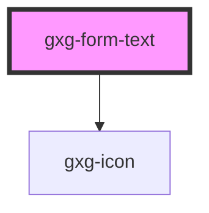

# gxg-form-text

<!-- Auto Generated Below -->

## Properties

| Property       | Attribute       | Description                                                                           | Type                                                                                                                                                                                                                                                                                                                                                                                                                                                    | Default     |
| -------------- | --------------- | ------------------------------------------------------------------------------------- | ------------------------------------------------------------------------------------------------------------------------------------------------------------------------------------------------------------------------------------------------------------------------------------------------------------------------------------------------------------------------------------------------------------------------------------------------------- | ----------- |
| `disabled`     | `disabled`      | If input is disabled                                                                  | `boolean`                                                                                                                                                                                                                                                                                                                                                                                                                                               | `false`     |
| `error`        | `error`         | If input has errors                                                                   | `boolean`                                                                                                                                                                                                                                                                                                                                                                                                                                               | `false`     |
| `fullWidth`    | `full-width`    | If input is full width                                                                | `boolean`                                                                                                                                                                                                                                                                                                                                                                                                                                               | `false`     |
| `icon`         | `icon`          | Input icon possible values: the same as the values for the icon component             | `"more-info" \| "error" \| "warning" \| "success" \| "none" \| "add" \| "add-circle" \| "arrow-down" \| "arrow-left" \| "arrow-right" \| "arrow-up" \| "chevron-down" \| "chevron-left" \| "chevron-right" \| "chevron-up" \| "close" \| "color-picker" \| "deleted" \| "drag" \| "duplicate" \| "edit-wand" \| "edit" \| "empty" \| "level-down" \| "level-up" \| "reset" \| "search" \| "settings" \| "show-more-horizontal" \| "show-more-vertical"` | `null`      |
| `iconPosition` | `icon-position` | Input icon side possible values: left, right                                          | `"left" \| "right"`                                                                                                                                                                                                                                                                                                                                                                                                                                     | `null`      |
| `inputId`      | `input-id`      | The input id                                                                          | `string`                                                                                                                                                                                                                                                                                                                                                                                                                                                | `undefined` |
| `label`        | `label`         | The input label                                                                       | `string`                                                                                                                                                                                                                                                                                                                                                                                                                                                | `undefined` |
| `name`         | `name`          | The input name                                                                        | `string`                                                                                                                                                                                                                                                                                                                                                                                                                                                | `undefined` |
| `placeholder`  | `placeholder`   | The input placeholder                                                                 | `string`                                                                                                                                                                                                                                                                                                                                                                                                                                                | `undefined` |
| `readOnly`     | `read-only`     | If this property is true, the border, the icon, and the background will be invisible. | `boolean`                                                                                                                                                                                                                                                                                                                                                                                                                                               | `undefined` |
| `required`     | `required`      | If required                                                                           | `boolean`                                                                                                                                                                                                                                                                                                                                                                                                                                               | `false`     |
| `value`        | `value`         | The input value                                                                       | `string`                                                                                                                                                                                                                                                                                                                                                                                                                                                | `undefined` |
| `warning`      | `warning`       | If input has warning                                                                  | `boolean`                                                                                                                                                                                                                                                                                                                                                                                                                                               | `false`     |
| `width`        | `width`         | input width                                                                           | `string`                                                                                                                                                                                                                                                                                                                                                                                                                                                | `"240px"`   |

## Events

| Event    | Description | Type               |
| -------- | ----------- | ------------------ |
| `change` |             | `CustomEvent<any>` |
| `input`  |             | `CustomEvent<any>` |

## Dependencies

### Depends on

- [gxg-icon](../icon)

### Graph

---

_Built with [StencilJS](https://stenciljs.com/)_
