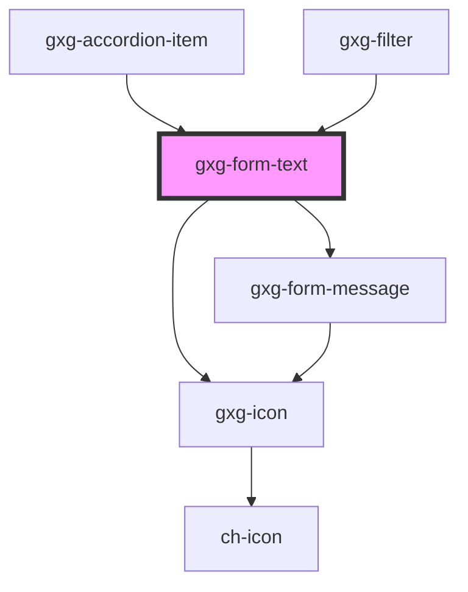

# gxg-form-text

<h2>Adding custom error or warning messages</h2>
<ul><li>To add an <em>error message</em>, append the following to the <code>gxg-form-text</code> : 
  <pre><code>
      let gxgFromText = document.getElementById("gxg-form-text");
      let errorMessage = document.createElement("gxg-form-message");
      errorMessage.setAttribute("type", "error");
      errorMessage.setAttribute("slot", "message");
      errorMessage.textContent = "this is an error message";
      gxgFromText.appendChild(errorMessage);
  </code></pre>
 </li>
<li>To add a <em>warning message</em>, do the same but change the <code>type</code> attribute to <code>warning</code>:
  <pre><code>
      let gxgFromText = document.getElementById("gxg-form-text");
      let warningMessage = document.createElement("gxg-form-message");
      warningMessage.setAttribute("type", "warning");
      warningMessage.setAttribute("slot", "message");
      warningMessage.textContent = "this is a warning message";
      gxgFromText.appendChild(warningMessage);
  </code></pre> </li>
</ul>

<!-- Auto Generated Below -->

## Properties

| Property             | Attribute              | Description                                                                                                                                                    | Type                                                                                         | Default     |
| -------------------- | ---------------------- | -------------------------------------------------------------------------------------------------------------------------------------------------------------- | -------------------------------------------------------------------------------------------- | ----------- |
| `clearButton`        | `clear-button`         | The presence of this attribute displays a clear (cross) button-icon on the right side                                                                          | `boolean`                                                                                    | `false`     |
| `disabled`           | `disabled`             | The presence of this attribute makes the input disabled                                                                                                        | `boolean`                                                                                    | `false`     |
| `error`              | `error`                | The presence of this attribute gives the component error styles                                                                                                | `boolean`                                                                                    | `false`     |
| `icon`               | `icon`                 | The input icon (optional)                                                                                                                                      | `any`                                                                                        | `null`      |
| `iconPosition`       | `icon-position`        | The input icon side                                                                                                                                            | `"end" \| "start"`                                                                           | `null`      |
| `label`              | `label`                | The input label                                                                                                                                                | `string`                                                                                     | `undefined` |
| `labelPosition`      | `label-position`       | The input label                                                                                                                                                | `"above" \| "start"`                                                                         | `undefined` |
| `maxWidth`           | `max-width`            | The input max. width                                                                                                                                           | `string`                                                                                     | `"100%"`    |
| `minimal`            | `minimal`              | The presence of this attribute hides the border, and sets the background to transparent when the element has no focus                                          | `boolean`                                                                                    | `false`     |
| `overDarkBackground` | `over-dark-background` | The presence of this attribute sets the text color to white. Usefull when "minimal" attribute is applied and the background behind the input is dark           | `boolean`                                                                                    | `false`     |
| `placeholder`        | `placeholder`          | The input placeholder                                                                                                                                          | `string`                                                                                     | `undefined` |
| `required`           | `required`             | The presence of this attribute makes this input required                                                                                                       | `boolean`                                                                                    | `false`     |
| `requiredMessage`    | `required-message`     | The required message if this input is required and no value is provided (optional). If this is not provided, the default browser required message will show up | `string`                                                                                     | `undefined` |
| `textStyle`          | `text-style`           | The text style                                                                                                                                                 | `"quote" \| "regular" \| "title-01" \| "title-02" \| "title-03" \| "title-04" \| "title-05"` | `"regular"` |
| `value`              | `value`                | The input value                                                                                                                                                | `string`                                                                                     | `undefined` |
| `warning`            | `warning`              | The presence of this attribute gives the component warning styles                                                                                              | `boolean`                                                                                    | `false`     |

## Events

| Event                | Description                  | Type               |
| -------------------- | ---------------------------- | ------------------ |
| `change`             | Returns the input value      | `CustomEvent<any>` |
| `clearButtonClicked` | The clear button was clicked | `CustomEvent<any>` |
| `input`              | Returns the input value      | `CustomEvent<any>` |

## Methods

### `setFocus() => Promise<void>`

sets focus on the input

#### Returns

Type: `Promise<void>`

## Shadow Parts

| Part      | Description |
| --------- | ----------- |
| `"input"` |             |

## Dependencies

### Used by

- [gxg-accordion-item](../accordion-item)
- [gxg-filter](../filter)

### Depends on

- [gxg-icon](../icon)
- [gxg-form-message](../form-message)

### Graph

---

_Built with [StencilJS](https://stenciljs.com/)_
