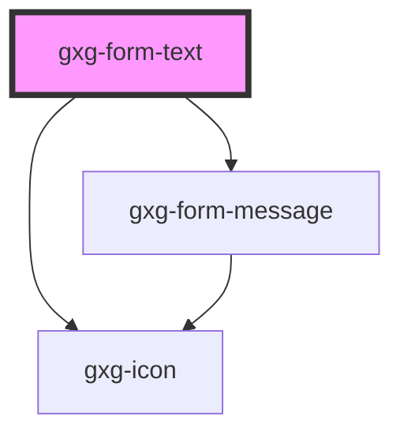

# gxg-form-text

<!-- Auto Generated Below -->

## Properties

| Property          | Attribute          | Description                                                                                                                                                    | Type                                                                                                                                                                                                                                                                                                                                                                                                                                                                                                       | Default     |
| ----------------- | ------------------ | -------------------------------------------------------------------------------------------------------------------------------------------------------------- | ---------------------------------------------------------------------------------------------------------------------------------------------------------------------------------------------------------------------------------------------------------------------------------------------------------------------------------------------------------------------------------------------------------------------------------------------------------------------------------------------------------- | ----------- |
| `borderless`      | `borderless`       | Is this attribute is present, the border will only be visible on hover                                                                                         | `boolean`                                                                                                                                                                                                                                                                                                                                                                                                                                                                                                  | `undefined` |
| `disabled`        | `disabled`         | The presence of this attribute makes the input disabled                                                                                                        | `boolean`                                                                                                                                                                                                                                                                                                                                                                                                                                                                                                  | `false`     |
| `error`           | `error`            | The presence of this attribute gives the component error styles                                                                                                | `boolean`                                                                                                                                                                                                                                                                                                                                                                                                                                                                                                  | `false`     |
| `icon`            | `icon`             | The input icon (optional) possible values: the same as the values for the icon component                                                                       | `"error" \| "success" \| "warning" \| "none" \| "add" \| "add-circle" \| "arrow-down" \| "arrow-left" \| "arrow-right" \| "arrow-up" \| "chevron-down" \| "chevron-left" \| "chevron-right" \| "chevron-up" \| "close" \| "color-picker" \| "deleted" \| "drag" \| "duplicate" \| "edit-wand" \| "edit" \| "empty" \| "file" \| "folder" \| "level-down" \| "level-up" \| "minus" \| "minus-circle" \| "more-info" \| "reset" \| "search" \| "settings" \| "show-more-horizontal" \| "show-more-vertical"` | `null`      |
| `iconPosition`    | `icon-position`    | The input icon side                                                                                                                                            | `"left" \| "right"`                                                                                                                                                                                                                                                                                                                                                                                                                                                                                        | `null`      |
| `inputId`         | `input-id`         | The input id                                                                                                                                                   | `string`                                                                                                                                                                                                                                                                                                                                                                                                                                                                                                   | `undefined` |
| `label`           | `label`            | The input label                                                                                                                                                | `string`                                                                                                                                                                                                                                                                                                                                                                                                                                                                                                   | `undefined` |
| `maxWidth`        | `max-width`        | The input max. width                                                                                                                                           | `string`                                                                                                                                                                                                                                                                                                                                                                                                                                                                                                   | `"100%"`    |
| `name`            | `name`             | The input name                                                                                                                                                 | `string`                                                                                                                                                                                                                                                                                                                                                                                                                                                                                                   | `undefined` |
| `placeholder`     | `placeholder`      | The input placeholder                                                                                                                                          | `string`                                                                                                                                                                                                                                                                                                                                                                                                                                                                                                   | `undefined` |
| `required`        | `required`         | The presence of this attribute makes this input required                                                                                                       | `boolean`                                                                                                                                                                                                                                                                                                                                                                                                                                                                                                  | `false`     |
| `requiredMessage` | `required-message` | The required message if this input is required and no value is provided (optional). If this is not provided, the default browser required message will show up | `string`                                                                                                                                                                                                                                                                                                                                                                                                                                                                                                   | `undefined` |
| `value`           | `value`            | The input value                                                                                                                                                | `string`                                                                                                                                                                                                                                                                                                                                                                                                                                                                                                   | `undefined` |
| `warning`         | `warning`          | The presence of this attribute gives the component warning styles                                                                                              | `boolean`                                                                                                                                                                                                                                                                                                                                                                                                                                                                                                  | `false`     |

## Events

| Event    | Description | Type               |
| -------- | ----------- | ------------------ |
| `change` |             | `CustomEvent<any>` |
| `input`  |             | `CustomEvent<any>` |

## Dependencies

### Depends on

- [gxg-icon](../icon)
- [gxg-form-message](../form-message)

### Graph

---

_Built with [StencilJS](https://stenciljs.com/)_
