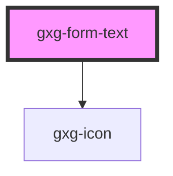

# gxg-form-text

<!-- Auto Generated Below -->

## Properties

| Property       | Attribute       | Description                                                               | Type                                                                                                                                                                                                                                                                                                                                                                  | Default     |
| -------------- | --------------- | ------------------------------------------------------------------------- | --------------------------------------------------------------------------------------------------------------------------------------------------------------------------------------------------------------------------------------------------------------------------------------------------------------------------------------------------------------------- | ----------- |
| `disabled`     | `disabled`      | If input is disabled                                                      | `boolean`                                                                                                                                                                                                                                                                                                                                                             | `false`     |
| `error`        | `error`         | If input has errors                                                       | `boolean`                                                                                                                                                                                                                                                                                                                                                             | `false`     |
| `fullWidth`    | `full-width`    | If input is full width                                                    | `boolean`                                                                                                                                                                                                                                                                                                                                                             | `false`     |
| `icon`         | `icon`          | Input icon possible values: the same as the values for the icon component | `"none" \| "arrow-down" \| "arrow-left" \| "arrow-right" \| "arrow-up" \| "chevron-down" \| "chevron-left" \| "chevron-right" \| "chevron-up" \| "close" \| "color-picker" \| "deleted" \| "drag" \| "duplicate" \| "edit-wand" \| "edit" \| "error" \| "level-down" \| "level-up" \| "more-info" \| "search" \| "settings" \| "show-more" \| "success" \| "warning"` | `null`      |
| `iconPosition` | `icon-position` | Input icon side possible values: left, right                              | `"left" \| "right"`                                                                                                                                                                                                                                                                                                                                                   | `null`      |
| `inlineFlex`   | `inline-flex`   | Inline-flex display                                                       | `boolean`                                                                                                                                                                                                                                                                                                                                                             | `false`     |
| `inputId`      | `input-id`      | The input id                                                              | `string`                                                                                                                                                                                                                                                                                                                                                              | `undefined` |
| `label`        | `label`         | The input label                                                           | `string`                                                                                                                                                                                                                                                                                                                                                              | `undefined` |
| `name`         | `name`          | The input name                                                            | `string`                                                                                                                                                                                                                                                                                                                                                              | `undefined` |
| `placeholder`  | `placeholder`   | The input placeholder                                                     | `string`                                                                                                                                                                                                                                                                                                                                                              | `undefined` |
| `value`        | `value`         | The input value                                                           | `string`                                                                                                                                                                                                                                                                                                                                                              | `undefined` |
| `warning`      | `warning`       | If input has warning                                                      | `boolean`                                                                                                                                                                                                                                                                                                                                                             | `false`     |
| `width`        | `width`         | input width                                                               | `string`                                                                                                                                                                                                                                                                                                                                                              | `"240px"`   |

## Dependencies

### Depends on

- [gxg-icon](../icon)

### Graph

---

_Built with [StencilJS](https://stenciljs.com/)_
