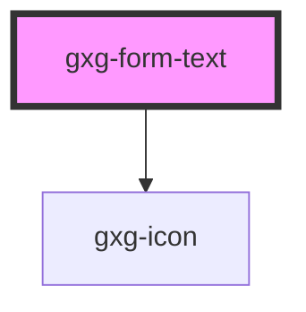

# gxg-button

<h2>Using a button</h2>
<ol>
    <li>Include the gx-button element: <code>&lt;gxg-button&gt;Button&lt;/gxg-button&gt;</code></li>
    <li>
        Set the type of button on the <em>type</em> property. There are six types of button at the time of writting: 
        <ul>
            <li><code>primary-text-only</code></li>
            <li><code>primary-text-icon</code></li>
            <li><code>primary-icon-only</code></li>
            <li><code>secondary-text-only</code></li>
            <li><code>secondary-icon-only</code></li>
            <li><code>outlined</code></li>
        </ul>
    </li>   
    <li>
        For the <em>icon</em> button types you will have to add an <em>icon component</em> as well, as part of the button content: 
        <code>&lt;gxg-icon slot=&quot;icon&quot; type=&quot;add&quot;&gt;&lt;/gxg-icon&gt;</code>. <em>gxg-icon</em> component expect the <em>type</em> property, which is the name of the icon. Note that gxg-icon has a <em>slot</em> property set to "icon". This property/value ensures that the icon will be positioned at the left side of the button label. To see the list of available icons check the <em>icon</em> component on the Storybook documentation. <strong>  note:</strong> When using an icon inside a <code>gxg-button</code> element, there is no need to set the icon <em>size</em> property, since the size will be set automatically by the button itself.
    </li>
</ol>

<!-- Auto Generated Below -->

## Properties

| Property       | Attribute       | Description                                                               | Type                                                                                                                                                                                                                                                                                                              | Default     |
| -------------- | --------------- | ------------------------------------------------------------------------- | ----------------------------------------------------------------------------------------------------------------------------------------------------------------------------------------------------------------------------------------------------------------------------------------------------------------- | ----------- |
| `disabled`     | `disabled`      | If input is disabled                                                      | `boolean`                                                                                                                                                                                                                                                                                                         | `false`     |
| `displayBlock` | `display-block` | Wether the input is inline or block                                       | `boolean`                                                                                                                                                                                                                                                                                                         | `false`     |
| `error`        | `error`         | If input has errors                                                       | `boolean`                                                                                                                                                                                                                                                                                                         | `false`     |
| `fullWidth`    | `full-width`    | If input is full width                                                    | `boolean`                                                                                                                                                                                                                                                                                                         | `false`     |
| `icon`         | `icon`          | Input icon possible values: the same as the values for the icon component | `"more-info" \| "error" \| "warning" \| "success" \| "none" \| "add" \| "chevron-down" \| "chevron-left" \| "chevron-right" \| "chevron-up" \| "close" \| "color-picker" \| "deleted" \| "down" \| "drag" \| "duplicate" \| "edit-wand" \| "edit" \| "level-up" \| "search" \| "settings" \| "show-more" \| "up"` | `undefined` |
| `iconSide`     | `icon-side`     | Input icon side possible values: left, right                              | `string`                                                                                                                                                                                                                                                                                                          | `"left"`    |
| `inputId`      | `input-id`      | The input id                                                              | `string`                                                                                                                                                                                                                                                                                                          | `undefined` |
| `label`        | `label`         | The input label                                                           | `string`                                                                                                                                                                                                                                                                                                          | `undefined` |
| `name`         | `name`          | The input name                                                            | `string`                                                                                                                                                                                                                                                                                                          | `undefined` |
| `placeholder`  | `placeholder`   | The input placeholder                                                     | `string`                                                                                                                                                                                                                                                                                                          | `undefined` |
| `value`        | `value`         | The input value                                                           | `string`                                                                                                                                                                                                                                                                                                          | `undefined` |
| `warning`      | `warning`       | If input has warning                                                      | `boolean`                                                                                                                                                                                                                                                                                                         | `false`     |
| `width`        | `width`         | input width                                                               | `string`                                                                                                                                                                                                                                                                                                          | `"240px"`   |

## Dependencies

### Depends on

- [gxg-icon](../icon)

### Graph

---

_Built with [StencilJS](https://stenciljs.com/)_
