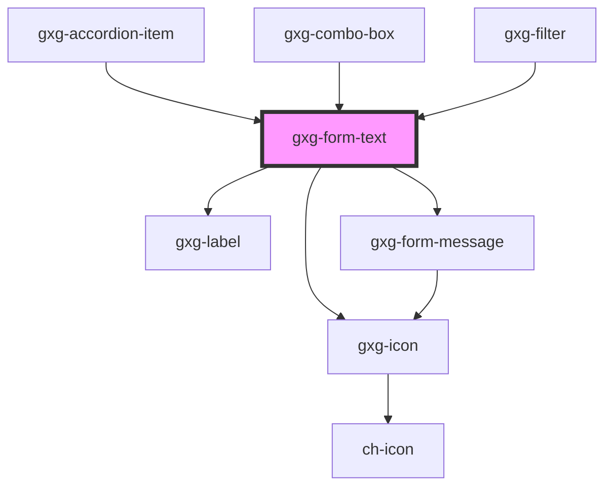

# gxg-form-text

<h2>Adding custom error or warning messages</h2>
<ul><li>To add an <em>error message</em>, append the following to the <code>gxg-form-text</code> : 
  <pre><code>
      let gxgFromText = document.getElementById("gxg-form-text");
      let errorMessage = document.createElement("gxg-form-message");
      errorMessage.setAttribute("type", "error");
      errorMessage.setAttribute("slot", "message");
      errorMessage.textContent = "this is an error message";
      gxgFromText.appendChild(errorMessage);
  </code></pre>
 </li>
<li>To add a <em>warning message</em>, do the same but change the <code>type</code> attribute to <code>warning</code>:
  <pre><code>
      let gxgFromText = document.getElementById("gxg-form-text");
      let warningMessage = document.createElement("gxg-form-message");
      warningMessage.setAttribute("type", "warning");
      warningMessage.setAttribute("slot", "message");
      warningMessage.textContent = "this is a warning message";
      gxgFromText.appendChild(warningMessage);
  </code></pre> </li>
</ul>

<!-- Auto Generated Below -->

## Usage

### Usage

```
  <gxg-form-text label="Full name" label-position="top" placeholder="John Smith" id="gxg-form-text" max-width="240px"></gxg-form-text>
  <br>
  <gxg-button id="btn-set-focus">set focus</gxg-button>
  <gxg-button id="btn-show-errors">Show errors</gxg-button>
  <br>
  <br>
  <gxg-form-text icon="gemini-tools/edit" icon-position="start" label="Full name" label-position="top" placeholder="John Smith" id="gxg-form-text" max-width="240px"></gxg-form-text>
  <br>
  <gxg-form-text icon="gemini-tools/edit" icon-position="end" label="Full name" label-position="top" placeholder="John Smith" id="gxg-form-text" max-width="240px"></gxg-form-text>
  <br>
  <gxg-form-text clear-button icon="gemini-tools/edit" icon-position="start" label="Full name" label-position="top" placeholder="John Smith" id="gxg-form-text" max-width="240px"></gxg-form-text>
  <br>
  <gxg-form-text clear-button icon="gemini-tools/edit" icon-position="end" label="Full name" label-position="top" placeholder="John Smith" id="gxg-form-text" max-width="240px"></gxg-form-text>

   <script>
      //Set focus programatically
      let btnSetFocus = document.getElementById("btn-set-focus");
      let formText = document.getElementById("gxg-form-text");
      btnSetFocus.addEventListener("click", function(){
        formText.focus();
      })

      //Display error message
      const btnShowErrors = document.getElementById("btn-show-errors");
      btnShowErrors.addEventListener("click", function(){
      const gxgFormText = document.getElementById("gxg-form-text");
      const gxgFormMessage = document.createElement("gxg-form-message");
      gxgFormMessage.innerHTML = "Please, provide your full name";
      gxgFormMessage.setAttribute("type", "error");
      gxgFormMessage.setAttribute("slot", "message");
      gxgFormText.setAttribute("error",true);
      gxgFormText.appendChild(gxgFormMessage);
    });
  </script>
```

## Properties

| Property                | Attribute                 | Description                                                                                                                                          | Type                                                                                         | Default     |
| ----------------------- | ------------------------- | ---------------------------------------------------------------------------------------------------------------------------------------------------- | -------------------------------------------------------------------------------------------- | ----------- |
| `borderless`            | `borderless`              | The presence of this attribute hides the border.                                                                                                     | `boolean`                                                                                    | `false`     |
| `clearButton`           | `clear-button`            | The presence of this attribute displays a clear (cross) button-icon on the right side                                                                | `boolean`                                                                                    | `false`     |
| `disabled`              | `disabled`                | The presence of this attribute makes the input disabled                                                                                              | `boolean`                                                                                    | `false`     |
| `error`                 | `error`                   | The presence of this attribute gives the component error styles                                                                                      | `boolean`                                                                                    | `false`     |
| `hideValidationMessage` | `hide-validation-message` | The presence of this attribute will show a validation message if the input has an error                                                              | `boolean`                                                                                    | `false`     |
| `icon`                  | `icon`                    | The input icon (optional)                                                                                                                            | `any`                                                                                        | `null`      |
| `iconPosition`          | `icon-position`           | The input icon side                                                                                                                                  | `"end" \| "start"`                                                                           | `null`      |
| `label`                 | `label`                   | The input label                                                                                                                                      | `string`                                                                                     | `undefined` |
| `labelPosition`         | `label-position`          | The input label                                                                                                                                      | `"above" \| "start"`                                                                         | `undefined` |
| `maxLength`             | `max-length`              | The input max. length                                                                                                                                | `string`                                                                                     | `undefined` |
| `maxWidth`              | `max-width`               | The input max. width                                                                                                                                 | `string`                                                                                     | `"100%"`    |
| `minLength`             | `min-length`              | The input min. length                                                                                                                                | `string`                                                                                     | `undefined` |
| `minimal`               | `minimal`                 | The presence of this attribute hides the border, and sets the background to transparent when the element has no focus                                | `boolean`                                                                                    | `false`     |
| `overDarkBackground`    | `over-dark-background`    | The presence of this attribute sets the text color to white. Usefull when "minimal" attribute is applied and the background behind the input is dark | `boolean`                                                                                    | `false`     |
| `password`              | `password`                | The presence of this attribute sets the input type as password                                                                                       | `boolean`                                                                                    | `false`     |
| `pattern`               | `pattern`                 | The input pattern attribute specifies a regular expression that the input field's value is checked against                                           | `string`                                                                                     | `undefined` |
| `placeholder`           | `placeholder`             | The input placeholder                                                                                                                                | `string`                                                                                     | `undefined` |
| `readonly`              | `readonly`                | The presence of this attribute makes the input readonly                                                                                              | `boolean`                                                                                    | `false`     |
| `required`              | `required`                | The presence of this attribute makes this input required                                                                                             | `boolean`                                                                                    | `false`     |
| `textStyle`             | `text-style`              | The text style                                                                                                                                       | `"quote" \| "regular" \| "title-01" \| "title-02" \| "title-03" \| "title-04" \| "title-05"` | `"regular"` |
| `validateOnInput`       | `validate-on-input`       | The presence of this attribute will check the input validity on every user input                                                                     | `boolean`                                                                                    | `false`     |
| `validationMessage`     | `validation-message`      | The message to display when validity is false                                                                                                        | `string`                                                                                     | `undefined` |
| `value`                 | `value`                   | The input value                                                                                                                                      | `string`                                                                                     | `undefined` |
| `warning`               | `warning`                 | The presence of this attribute gives the component warning styles                                                                                    | `boolean`                                                                                    | `false`     |

## Events

| Event                    | Description                  | Type               |
| ------------------------ | ---------------------------- | ------------------ |
| `change`                 | Returns the input value      | `CustomEvent<any>` |
| `clearButtonClicked`     | The clear button was clicked | `CustomEvent<any>` |
| `input`                  | Returns the input value      | `CustomEvent<any>` |
| `validationErrorMessage` | The validation error message | `CustomEvent<any>` |

## Methods

### `validate() => Promise<void>`

---

METHODS

---

#### Returns

Type: `Promise<void>`

## Shadow Parts

| Part      | Description |
| --------- | ----------- |
| `"input"` |             |

## Dependencies

### Used by

- [gxg-accordion-item](../accordion-item)
- [gxg-combo-box](../combo-box)
- [gxg-filter](../filter)

### Depends on

- [gxg-icon](../icon)
- [gxg-label](../label)
- [gxg-form-message](../form-message)

### Graph



---

_Built with [StencilJS](https://stenciljs.com/)_
