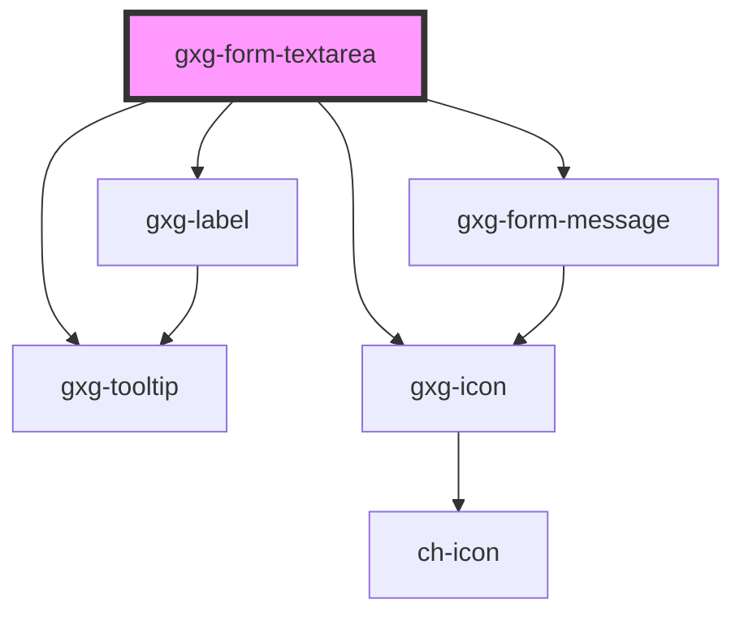

# gxg-form-textarea

<!-- Auto Generated Below -->

## Usage

### Usage

```
<gxg-form-textarea
id="gxg-textarea"
max-width="240px"
label="Describe your experience"
placeholder="I have experience as a.."
rows="4">
</gxg-form-textarea>
<br>
<gxg-button id="btn-show-errors">Show errors</gxg-button>

<script>
//Display error message
const btnShowErrors = document.getElementById("btn-show-errors");
btnShowErrors.addEventListener("click", function(){
    const gxgFormTextArea = document.getElementById("gxg-textarea");
    const gxgFormMessage = document.createElement("gxg-form-message");
    gxgFormMessage.innerHTML = "Please, describe your experience";
    gxgFormMessage.setAttribute("type", "error");
    gxgFormMessage.setAttribute("slot", "message");
    gxgFormTextArea.setAttribute("error",true);
    gxgFormTextArea.appendChild(gxgFormMessage);
});
</script>
```

## Properties

| Property                | Attribute                 | Description                                                                                                                                                    | Type                                                   | Default           |
| ----------------------- | ------------------------- | -------------------------------------------------------------------------------------------------------------------------------------------------------------- | ------------------------------------------------------ | ----------------- |
| `ai`                    | `ai`                      | This property it is for using the textarea for the ai-assistant in ide-web (Mercury).                                                                          | `boolean`                                              | `false`           |
| `centerLabel`           | `center-label`            | Centers the label                                                                                                                                              | `boolean`                                              | `false`           |
| `disabled`              | `disabled`                | The presence of this attribute makes the component disabled                                                                                                    | `boolean`                                              | `false`           |
| `error`                 | `error`                   | The presence of this attribute gives the component error styles                                                                                                | `boolean`                                              | `false`           |
| `height`                | `height`                  | The textarea height                                                                                                                                            | `string`                                               | `"auto"`          |
| `hideValidationMessage` | `hide-validation-message` | The presence of this attribute will show a validation message if the input has an error                                                                        | `boolean`                                              | `false`           |
| `informationMessage`    | `information-message`     | An informative message to help the user filling the information                                                                                                | `string`                                               | `undefined`       |
| `label`                 | `label`                   | The textarea label                                                                                                                                             | `string`                                               | `undefined`       |
| `labelPosition`         | `label-position`          | The label position                                                                                                                                             | `"above" \| "below" \| "end" \| "start"`               | `"above"`         |
| `labelWidth`            | `label-width`             | The label width                                                                                                                                                | `any`                                                  | `undefined`       |
| `maxHeight`             | `max-height`              | The max-height                                                                                                                                                 | `string`                                               | `undefined`       |
| `maxWidth`              | `max-width`               | The max-width                                                                                                                                                  | `string`                                               | `"100%"`          |
| `placeholder`           | `placeholder`             | The textarea placeholder                                                                                                                                       | `string`                                               | `undefined`       |
| `required`              | `required`                | Make the radio-buttons required                                                                                                                                | `boolean`                                              | `false`           |
| `resize`                | `resize`                  | Allow or not text area resize                                                                                                                                  | `boolean`                                              | `false`           |
| `rows`                  | `rows`                    | The number of rows                                                                                                                                             | `number`                                               | `4`               |
| `singleLine`            | `single-line`             | The presence of this attribute forces the textarea to be as tall as an input text. When the textarea gets focus, it ais as tall as the "height: property.      | `boolean`                                              | `false`           |
| `toolTip`               | `tool-tip`                | The presence of this attribute displays a tooltip message, instead of a block message below the control                                                        | `boolean`                                              | `false`           |
| `validationMessage`     | `validation-message`      | The required message if this input is required and no value is provided (optional). If this is not provided, the default browser required message will show up | `string`                                               | `undefined`       |
| `validationStatus`      | `validation-status`       | The validation status                                                                                                                                          | `"error" \| "indeterminate" \| "success" \| "warning"` | `"indeterminate"` |
| `value`                 | `value`                   | The textarea value                                                                                                                                             | `string`                                               | `undefined`       |
| `warning`               | `warning`                 | The presence of this attribute gives the component warning styles                                                                                              | `boolean`                                              | `false`           |

## Events

| Event    | Description                                                                                  | Type               |
| -------- | -------------------------------------------------------------------------------------------- | ------------------ |
| `change` | Returns the textarea value                                                                   | `CustomEvent<any>` |
| `enter`  | Emits the enter keydown event. It emits the actual textarea value. Used for the Ai-Assistant | `CustomEvent<any>` |
| `input`  | Returns the textarea value                                                                   | `CustomEvent<any>` |

## Shadow Parts

| Part                 | Description |
| -------------------- | ----------- |
| `"textarea"`         |             |
| `"textarea-wrapper"` |             |

## Dependencies

### Depends on

- [gxg-label](../label)
- [gxg-form-message](../form-message)
- [gxg-tooltip](../tooltip)
- [gxg-icon](../icon)

### Graph



---

_Built with [StencilJS](https://stenciljs.com/)_
