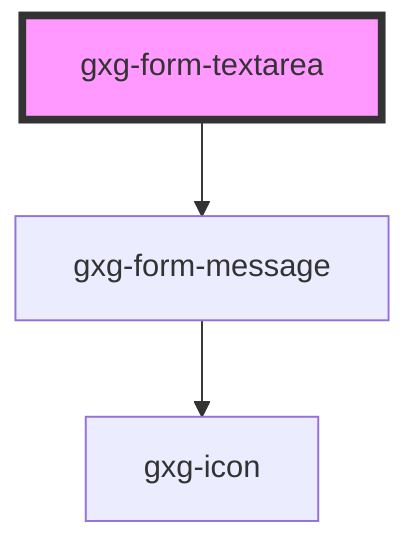

# gxg-form-textarea

<!-- Auto Generated Below -->

## Properties

| Property          | Attribute          | Description                  | Type      | Default     |
| ----------------- | ------------------ | ---------------------------- | --------- | ----------- |
| `cols`            | `cols`             | Number of cols               | `number`  | `40`        |
| `disabled`        | `disabled`         | If textarea is disabled      | `boolean` | `false`     |
| `displayBlock`    | `display-block`    | If textarea display is block | `boolean` | `false`     |
| `error`           | `error`            | If textarea has errors       | `boolean` | `false`     |
| `fullWidth`       | `full-width`       | If textarea is full width    | `boolean` | `false`     |
| `label`           | `label`            | The textarea label           | `string`  | `"hey"`     |
| `name`            | `name`             | The textarea name            | `string`  | `undefined` |
| `placeholder`     | `placeholder`      | The textarea placeholder     | `string`  | `"hola"`    |
| `required`        | `required`         | If required                  | `boolean` | `false`     |
| `requiredMessage` | `required-message` | Optional required message    | `string`  | `undefined` |
| `rows`            | `rows`             | Number of rows               | `number`  | `4`         |
| `textareaId`      | `textarea-id`      | The textarea id              | `string`  | `undefined` |
| `value`           | `value`            | The textarea value           | `string`  | `undefined` |
| `warning`         | `warning`          | If textarea has warnings     | `boolean` | `false`     |

## Events

| Event    | Description | Type               |
| -------- | ----------- | ------------------ |
| `change` |             | `CustomEvent<any>` |
| `input`  |             | `CustomEvent<any>` |

## Dependencies

### Depends on

- [gxg-form-message](../form-message)

### Graph

---

_Built with [StencilJS](https://stenciljs.com/)_
