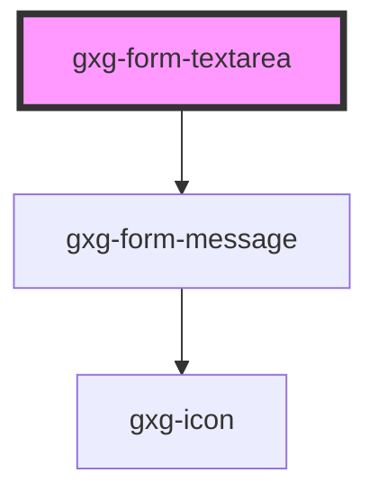

# gxg-form-textarea

<!-- Auto Generated Below -->

## Properties

| Property          | Attribute          | Description                                                                                                                                                    | Type      | Default     |
| ----------------- | ------------------ | -------------------------------------------------------------------------------------------------------------------------------------------------------------- | --------- | ----------- |
| `disabled`        | `disabled`         | The presence of this attribute makes the textarea disabled                                                                                                     | `boolean` | `false`     |
| `error`           | `error`            | The presence of this attribute gives the component error styles                                                                                                | `boolean` | `false`     |
| `label`           | `label`            | The textarea label                                                                                                                                             | `string`  | `"hey"`     |
| `maxWidth`        | `max-width`        | The max-width                                                                                                                                                  | `string`  | `"100%"`    |
| `name`            | `name`             | The textarea name                                                                                                                                              | `string`  | `undefined` |
| `placeholder`     | `placeholder`      | The textarea placeholder                                                                                                                                       | `string`  | `undefined` |
| `required`        | `required`         | The presence of this attribute makes the textarea required                                                                                                     | `boolean` | `false`     |
| `requiredMessage` | `required-message` | The required message if this input is required and no value is provided (optional). If this is not provided, the default browser required message will show up | `string`  | `undefined` |
| `rows`            | `rows`             | The number of rows                                                                                                                                             | `number`  | `4`         |
| `textareaId`      | `textarea-id`      | The textarea id                                                                                                                                                | `string`  | `undefined` |
| `value`           | `value`            | The textarea value                                                                                                                                             | `string`  | `undefined` |
| `warning`         | `warning`          | The presence of this attribute gives the component warning styles                                                                                              | `boolean` | `false`     |

## Events

| Event    | Description | Type               |
| -------- | ----------- | ------------------ |
| `change` |             | `CustomEvent<any>` |
| `input`  |             | `CustomEvent<any>` |

## Dependencies

### Depends on

- [gxg-form-message](../form-message)

### Graph

---

_Built with [StencilJS](https://stenciljs.com/)_
