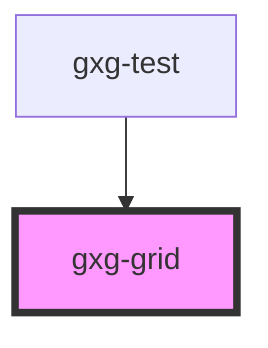

# gxg-grid

<!-- Auto Generated Below -->

## Properties

| Property   | Attribute   | Description | Type      | Default |
| ---------- | ----------- | ----------- | --------- | ------- |
| `noBorder` | `no-border` |             | `boolean` | `false` |

## Dependencies

### Used by

- [gxg-test](../test)

### Graph

---

_Built with [StencilJS](https://stenciljs.com/)_
