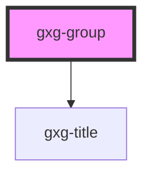

# gxg-group

<!-- Auto Generated Below -->

## Properties

| Property           | Attribute            | Description                                                            | Type                           | Default     |
| ------------------ | -------------------- | ---------------------------------------------------------------------- | ------------------------------ | ----------- |
| `displayBorder`    | `display-border`     | Makes this group has a border all around                               | `boolean`                      | `false`     |
| `fieldset`         | `fieldset`           | Makes this group act as a fieldset                                     | `boolean`                      | `false`     |
| `footerJustify`    | `footer-justify`     | The footer justification                                               | `"center" \| "end" \| "start"` | `"end"`     |
| `groupTitle`       | `group-title`        | The title of the group                                                 | `string`                       | `undefined` |
| `headingJustify`   | `heading-justify`    | The heading justification                                              | `"center" \| "end" \| "start"` | `"center"`  |
| `noBorderBottom`   | `no-border-bottom`   | Removes the component border on the bottom                             | `boolean`                      | `false`     |
| `noBorderEnd`      | `no-border-end`      | Removes the component border on the end                                | `boolean`                      | `false`     |
| `noBorderFooter`   | `no-border-footer`   | Removes the border top from the footer                                 | `boolean`                      | `false`     |
| `noBorderStart`    | `no-border-start`    | Removes the component border on the start                              | `boolean`                      | `false`     |
| `noBorderTop`      | `no-border-top`      | Removes the component border on the top                                | `boolean`                      | `false`     |
| `noContentGap`     | `no-content-gap`     | Removes the gap from the content                                       | `boolean`                      | `false`     |
| `noContentPadding` | `no-content-padding` | Removes the padding from the content                                   | `boolean`                      | `false`     |
| `noFooterPadding`  | `no-footer-padding`  | Removes the padding from the footer                                    | `boolean`                      | `false`     |
| `noHeadingBorder`  | `no-heading-border`  | Removes the border bottom from the heading                             | `boolean`                      | `false`     |
| `noHeadingPadding` | `no-heading-padding` | Removes the padding from the heading                                   | `boolean`                      | `false`     |
| `sectionsPadding`  | `sections-padding`   | The group general padding (applies to .heading, .content, and .footer) | `"l" \| "m" \| "s"`            | `"m"`       |

## Dependencies

### Depends on

- [gxg-title](../title)

### Graph

---

_Built with [StencilJS](https://stenciljs.com/)_
