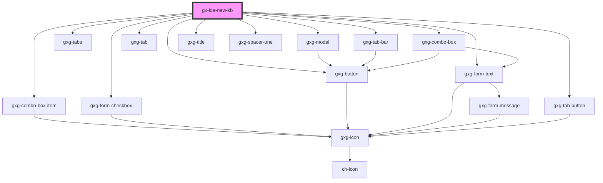

# gx-ide-new-kb

<!-- Auto Generated Below -->

## Properties

| Property                    | Attribute                        | Description                                                                                                                                 | Type         | Default     |
| --------------------------- | -------------------------------- | ------------------------------------------------------------------------------------------------------------------------------------------- | ------------ | ----------- |
| `UILanguages`               | --                               | Specify the language in which the application screens will be developed (default language)                                                  | `GxOption[]` | `undefined` |
| `authenticationTypes`       | --                               | Defines the type of authentication for the connection to the previously defined database                                                    | `GxOption[]` | `undefined` |
| `collations`                | --                               | DB Collations                                                                                                                               | `GxOption[]` | `undefined` |
| `createDatafilesInKBFolder` | `create-datafiles-in-k-b-folder` | Disabled if the first item of the 'Server Name' combo is selected                                                                           | `boolean`    | `false`     |
| `dataSources`               | --                               | It allows defining the DBMS that will be used in the solution                                                                               | `GxOption[]` | `undefined` |
| `databaseName`              | `database-name`                  | Name of the database where we are going to persist the information of our KB                                                                | `string`     | `undefined` |
| `frontEnd`                  | --                               | It allows selecting multiple generators for the front end                                                                                   | `GxOption[]` | `undefined` |
| `isAdvanced`                | `is-advanced`                    | Specify whether it is feasible to display information related to local configuration parameters                                             | `boolean`    | `false`     |
| `location`                  | `location`                       | Default suggested path to a directory where the information related to the KB will be stored/generated                                      | `string`     | `""`        |
| `name`                      | `name`                           | The knowledge base default suggested name                                                                                                   | `string`     | `""`        |
| `password`                  | `password`                       | Password for the database connection. Visible if the Authentication Type is different from Windows Authentication (first item of the combo) | `string`     | `undefined` |
| `prototypingEnvironments`   | --                               | It allows selecting the default environment that the KB will have (additional environments can be created later)                            | `GxOption[]` | `undefined` |
| `prototypingTargets`        | --                               | Path to a directory where the information related to the KB will be stored/generated                                                        | `GxOption[]` | `undefined` |
| `savePassword`              | `save-password`                  | Visible if something other than Windows Authentication is selected                                                                          | `boolean`    | `false`     |
| `serverNames`               | --                               | Name of the DB server where we want to persist the information of our KB                                                                    | `GxOption[]` | `undefined` |
| `userName`                  | `user-name`                      | Username for the database connection. Visible if the Authentication Type is different from Windows Authentication (first item of the combo) | `string`     | `undefined` |
| `visible`                   | `visible`                        | The dialog visibility                                                                                                                       | `boolean`    | `false`     |

## Dependencies

### Depends on

- [gxg-combo-box-item](../combo-box-item)
- [gxg-form-checkbox](../form-checkbox)
- [gxg-modal](../modal)
- [gxg-form-text](../form-text)
- [gxg-button](../button)
- [gxg-tabs](../tabs)
- [gxg-tab-bar](../tab-bar)
- [gxg-tab-button](../tab-button)
- [gxg-tab](../tab)
- [gxg-combo-box](../combo-box)
- [gxg-title](../title)
- [gxg-spacer-one](../spacer-one)

### Graph

---

_Built with [StencilJS](https://stenciljs.com/)_
