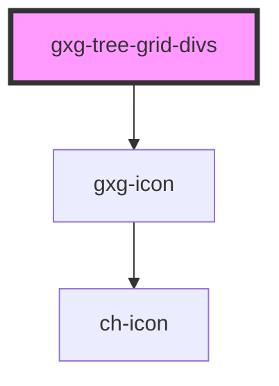

# gxg-tree-grid

<!-- Auto Generated Below -->

## Properties

| Property  | Attribute | Description | Type       | Default     |
| --------- | --------- | ----------- | ---------- | ----------- |
| `columns` | --        |             | `object[]` | `undefined` |
| `rows`    | --        |             | `object[]` | `undefined` |
| `width`   | `width`   |             | `string`   | `"100%"`    |

## Dependencies

### Depends on

- [gxg-icon](../icon)

### Graph

---

_Built with [StencilJS](https://stenciljs.com/)_
