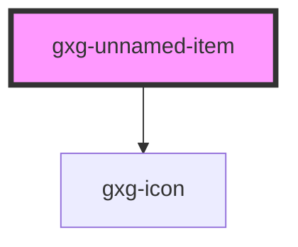

# gxg-unnamed-item

<!-- Auto Generated Below -->

## Properties

| Property | Attribute | Description         | Type  | Default     |
| -------- | --------- | ------------------- | ----- | ----------- |
| `type`   | `type`    | The icon (optional) | `any` | `undefined` |

## Dependencies

### Depends on

- [gxg-icon](../icon)

### Graph

---

_Built with [StencilJS](https://stenciljs.com/)_
