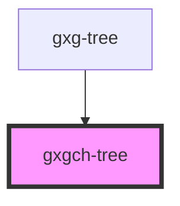

# gxgch-tree

<!-- Auto Generated Below -->

## Properties

| Property           | Attribute           | Description                                                                                                                                                                             | Type      | Default |
| ------------------ | ------------------- | --------------------------------------------------------------------------------------------------------------------------------------------------------------------------------------- | --------- | ------- |
| `checkbox`         | `checkbox`          | Set this attribute if you want all this tree tree-items to have a checkbox                                                                                                              | `boolean` | `false` |
| `checked`          | `checked`           | Set this attribute if you want all this tree tree-items to have the checkbox checked                                                                                                    | `boolean` | `false` |
| `toggleCheckboxes` | `toggle-checkboxes` | Set this attribute if you want all the childen item's checkboxes to be checked when the parent item checkbox is checked, or to be unchecked when the parent item checkbox is unckecked. | `boolean` | `false` |

## Methods

### `getChecked() => Promise<checkedChTreeItem[]>`

#### Returns

Type: `Promise<checkedChTreeItem[]>`

## Dependencies

### Used by

- [gxg-tree](../tree)

### Graph

---

_Built with [StencilJS](https://stenciljs.com/)_
