# gxg-icon

<!-- Auto Generated Below -->

## Properties

| Property | Attribute | Description                                            | Type                                                                                                                                                                                     | Default     |
| -------- | --------- | ------------------------------------------------------ | ---------------------------------------------------------------------------------------------------------------------------------------------------------------------------------------- | ----------- |
| `color`  | `color`   | The color of the icon.                                 | `"alwaysblack" \| "auto" \| "disabled" \| "error" \| "negative" \| "onbackground" \| "ondisabled" \| "primary-active" \| "primary-enabled" \| "primary-hover" \| "success" \| "warning"` | `undefined` |
| `size`   | `size`    | The size of the icon. Possible values: regular, small. | `"regular" \| "small"`                                                                                                                                                                   | `"regular"` |
| `type`   | `type`    | The type of icon.                                      | `any`                                                                                                                                                                                    | `undefined` |

## Shadow Parts

| Part        | Description |
| ----------- | ----------- |
| `"ch-icon"` |             |

## Dependencies

### Used by

- [gxg-accordion-item](../accordion-item)
- [gxg-alert](../alert)
- [gxg-breadcrumb](../breadcrumb)
- [gxg-button](../button)
- [gxg-combo-box-item](../combo-box-item)
- [gxg-contextual-menu-item](../contextual-menu-item)
- [gxg-drag-box](../drag-box)
- [gxg-drop-down](../drop-down)
- [gxg-filter-item](../filter-item)
- [gxg-form-checkbox](../form-checkbox)
- [gxg-form-message](../form-message)
- [gxg-form-text](../form-text)
- [gxg-list-box-item](../list-box-item)
- [gxg-menu-item](../menu-item)
- [gxg-more-info](../more-info)
- [gxg-option-v2](../form-option-v2)
- [gxg-pill](../pill)
- [gxg-tab-button](../tab-button)
- [gxg-toolbar](../toolbar)
- [gxg-toolbar-item](../toolbar-item)
- [gxg-tree-grid-divs](../tree-grid-divs)
- [gxg-tree-item](../tree-item)
- [gxg-window](../window)

### Depends on

- ch-icon

### Graph

```mermaid
graph TD;
  gxg-icon --> ch-icon
  gxg-accordion-item --> gxg-icon
  gxg-alert --> gxg-icon
  gxg-breadcrumb --> gxg-icon
  gxg-button --> gxg-icon
  gxg-combo-box-item --> gxg-icon
  gxg-contextual-menu-item --> gxg-icon
  gxg-drag-box --> gxg-icon
  gxg-drop-down --> gxg-icon
  gxg-filter-item --> gxg-icon
  gxg-form-checkbox --> gxg-icon
  gxg-form-message --> gxg-icon
  gxg-form-text --> gxg-icon
  gxg-list-box-item --> gxg-icon
  gxg-menu-item --> gxg-icon
  gxg-more-info --> gxg-icon
  gxg-option-v2 --> gxg-icon
  gxg-pill --> gxg-icon
  gxg-tab-button --> gxg-icon
  gxg-toolbar --> gxg-icon
  gxg-toolbar-item --> gxg-icon
  gxg-tree-grid-divs --> gxg-icon
  gxg-tree-item --> gxg-icon
  gxg-window --> gxg-icon
  style gxg-icon fill:#f9f,stroke:#333,stroke-width:4px
```

---

_Built with [StencilJS](https://stenciljs.com/)_
