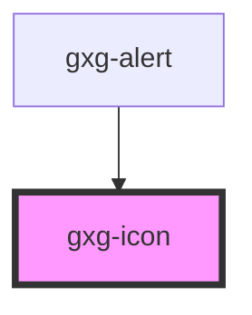

# gxg-icon

<!-- Auto Generated Below -->

## Properties

| Property | Attribute | Description                                                                                                                                                                                                | Type                                                                                                                                                                                                                                                                                                              | Default     |
| -------- | --------- | ---------------------------------------------------------------------------------------------------------------------------------------------------------------------------------------------------------- | ----------------------------------------------------------------------------------------------------------------------------------------------------------------------------------------------------------------------------------------------------------------------------------------------------------------- | ----------- |
| `color`  | `color`   | The color of the icon.                                                                                                                                                                                     | `"error" \| "negative" \| "onbackground" \| "success" \| "warning"`                                                                                                                                                                                                                                               | `undefined` |
| `lazy`   | `lazy`    | If enabled, the icon will be loaded lazily when it's visible in the viewport.                                                                                                                              | `boolean`                                                                                                                                                                                                                                                                                                         | `false`     |
| `size`   | `size`    | The size of the icon. Possible values: regular, small.                                                                                                                                                     | `"regular" \| "small" \| "tiny"`                                                                                                                                                                                                                                                                                  | `"regular"` |
| `type`   | `type`    | The type of icon. Possible values: each of the icons in /assets. The value is always the name of the svg file without the "gxg-icon-" prefix. Example: the value for the "gxg-icon-add.svg" file is "add". | `"more-info" \| "error" \| "warning" \| "success" \| "none" \| "add" \| "chevron-down" \| "chevron-left" \| "chevron-right" \| "chevron-up" \| "close" \| "color-picker" \| "deleted" \| "down" \| "drag" \| "duplicate" \| "edit-wand" \| "edit" \| "level-up" \| "search" \| "settings" \| "show-more" \| "up"` | `"none"`    |

## Dependencies

### Used by

- [gxg-alert](../alert)

### Graph

---

_Built with [StencilJS](https://stenciljs.com/)_
