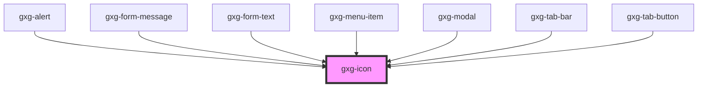

# gxg-icon

<h2>Using an icon</h2>
<ol>
    <li>Include the gx-icon component: <code>&lt;gxg-icon&gt;&lt;/gxg-icon&gt;</code></li>
    <li>set the <em>type</em> property to define the icon type. Click <a href="/story/icons--small-size-icons">here</a> to see the list of avaiable icons</li>
    <li>Icons come in two sizes: <a href="/story/icons--regular-size-icons">regular</a> or <a href="/story/icons--small-size-icons">small</a>. Set the <em>size</em> property equal to "small" if you intend to use the small version. By default, "regular" size will be selected.</li>
    <li>Icons come in five different colors: onbackground (black), negative (white), error (red), warning (orange), and green (success). By default, "onbackground" will be selected. Choose "negative" if you are using the icon over a dark background. To set the icon color, set the <em>color</em> property equal to any of the mentioned possible values.</li>
</ol>

<!-- Auto Generated Below -->

## Properties

| Property | Attribute | Description                                                                   | Type                                                                                                                                                                                                                                                                                                                                                                           | Default     |
| -------- | --------- | ----------------------------------------------------------------------------- | ------------------------------------------------------------------------------------------------------------------------------------------------------------------------------------------------------------------------------------------------------------------------------------------------------------------------------------------------------------------------------ | ----------- |
| `color`  | `color`   | The color of the icon.                                                        | `"disabled" \| "error" \| "negative" \| "onbackground" \| "success" \| "warning"`                                                                                                                                                                                                                                                                                              | `undefined` |
| `lazy`   | `lazy`    | If enabled, the icon will be loaded lazily when it's visible in the viewport. | `boolean`                                                                                                                                                                                                                                                                                                                                                                      | `false`     |
| `size`   | `size`    | The size of the icon. Possible values: regular, small.                        | `"regular" \| "small"`                                                                                                                                                                                                                                                                                                                                                         | `"regular"` |
| `type`   | `type`    | The type of icon. Possible values: each of the icons in /assets.              | `"error" \| "warning" \| "more-info" \| "success" \| "none" \| "add" \| "arrow-down" \| "arrow-left" \| "arrow-right" \| "arrow-up" \| "chevron-down" \| "chevron-left" \| "chevron-right" \| "chevron-up" \| "close" \| "color-picker" \| "deleted" \| "drag" \| "duplicate" \| "edit-wand" \| "edit" \| "level-down" \| "level-up" \| "search" \| "settings" \| "show-more"` | `"none"`    |

## Dependencies

### Used by

- [gxg-alert](../alert)
- [gxg-form-message](../form-message)
- [gxg-form-text](../form-text)
- [gxg-menu-item](../menu-item)
- [gxg-modal](../modal)
- [gxg-tab-bar](../tab-bar)
- [gxg-tab-button](../tab-button)

### Graph

---

_Built with [StencilJS](https://stenciljs.com/)_
