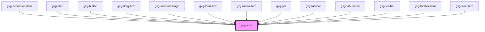

# gxg-icon

<!-- Auto Generated Below -->

## Properties

| Property | Attribute | Description                                                                   | Type                                                                                                                                                                                                                                                                                                                                                                                                                                                                                                                                                       | Default     |
| -------- | --------- | ----------------------------------------------------------------------------- | ---------------------------------------------------------------------------------------------------------------------------------------------------------------------------------------------------------------------------------------------------------------------------------------------------------------------------------------------------------------------------------------------------------------------------------------------------------------------------------------------------------------------------------------------------------- | ----------- |
| `color`  | `color`   | The color of the icon.                                                        | `"alwaysblack" \| "disabled" \| "error" \| "negative" \| "onbackground" \| "primary" \| "success" \| "warning"`                                                                                                                                                                                                                                                                                                                                                                                                                                            | `undefined` |
| `lazy`   | `lazy`    | If enabled, the icon will be loaded lazily when it's visible in the viewport. | `boolean`                                                                                                                                                                                                                                                                                                                                                                                                                                                                                                                                                  | `false`     |
| `size`   | `size`    | The size of the icon. Possible values: regular, small.                        | `"regular" \| "small"`                                                                                                                                                                                                                                                                                                                                                                                                                                                                                                                                     | `"regular"` |
| `type`   | `type`    | The type of icon. Possible values: each of the icons in /assets.              | `"error" \| "success" \| "warning" \| "none" \| "add" \| "add-circle" \| "arrow-down" \| "arrow-left" \| "arrow-right" \| "arrow-up" \| "chevron-down" \| "chevron-left" \| "chevron-right" \| "chevron-up" \| "circle" \| "close" \| "color-picker" \| "deleted" \| "drag" \| "duplicate" \| "edit" \| "edit-wand" \| "empty" \| "file" \| "folder" \| "level-down" \| "level-up" \| "minus" \| "minus-circle" \| "more-info" \| "pill-filled" \| "pill-outlined" \| "reset" \| "search" \| "settings" \| "show-more-horizontal" \| "show-more-vertical"` | `"none"`    |

## Dependencies

### Used by

- [gxg-accordion-item](../accordion-item)
- [gxg-alert](../alert)
- [gxg-button](../button)
- [gxg-drag-box](../drag-box)
- [gxg-form-message](../form-message)
- [gxg-form-text](../form-text)
- [gxg-menu-item](../menu-item)
- [gxg-pill](../pill)
- [gxg-tab-bar](../tab-bar)
- [gxg-tab-button](../tab-button)
- [gxg-toolbar](../toolbar)
- [gxg-toolbar-item](../toolbar-item)
- [gxg-tree-item](../tree-item)

### Graph

---

_Built with [StencilJS](https://stenciljs.com/)_
