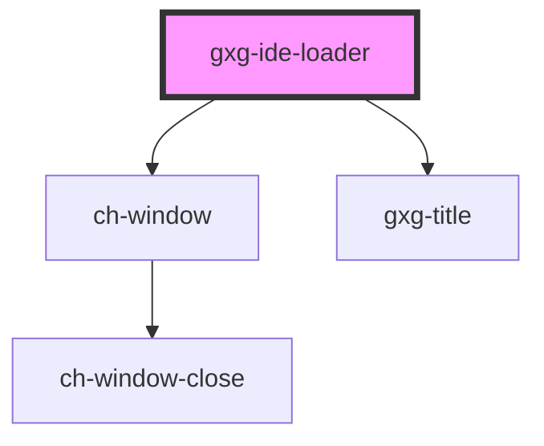

# gxg-ide-loader

<!-- Auto Generated Below -->

## Properties

| Property      | Attribute     | Description                           | Type          | Default     |
| ------------- | ------------- | ------------------------------------- | ------------- | ----------- |
| `container`   | --            | The container element for the loader. | `HTMLElement` | `undefined` |
| `description` | `description` | The loader description (optional)     | `string`      | `undefined` |
| `show`        | `show`        | It shows the loader                   | `boolean`     | `false`     |

## Dependencies

### Depends on

- ch-window
- [gxg-title](../title)

### Graph

----------------------------------------------

*Built with [StencilJS](https://stenciljs.com/)*
