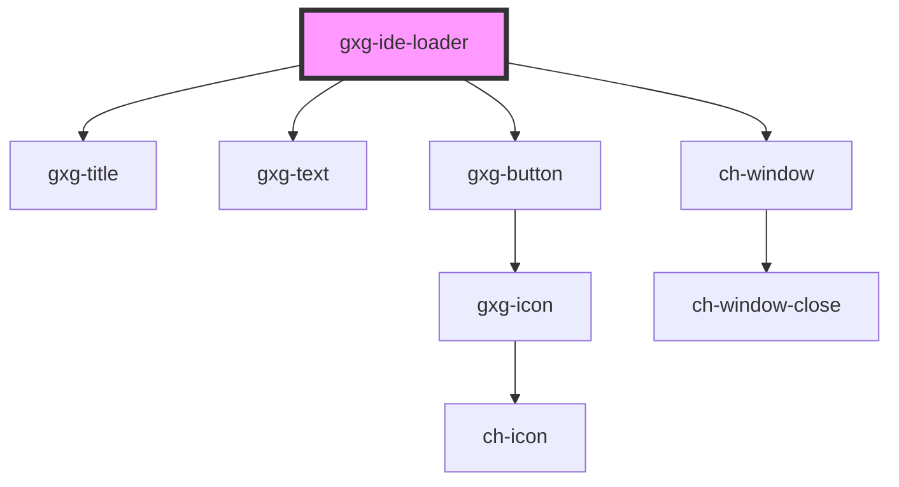

# gxg-ide-loader

<!-- Auto Generated Below -->

## Properties

| Property         | Attribute      | Description                                  | Type                  | Default     |
| ---------------- | -------------- | -------------------------------------------- | --------------------- | ----------- |
| `abortTime`      | `abort-time`   | The time the loader will await before abort. | `number`              | `5000`      |
| `cancelCallback` | --             | The cancel callback                          | `() => Promise<void>` | `undefined` |
| `cancelLabel`    | `cancel-label` | The cancel button label (optional)           | `string`              | `undefined` |
| `container`      | --             | The container element for the loader.        | `HTMLElement`         | `undefined` |
| `description`    | `description`  | The loader description (optional)            | `string`              | `undefined` |
| `loaderTitle`    | `loader-title` | The loader title (optional)                  | `string`              | `undefined` |
| `show`           | `show`         | It shows the loader                          | `boolean`             | `false`     |

## Dependencies

### Depends on

- [gxg-title](../title)
- [gxg-text](../text)
- [gxg-button](../button)
- ch-window

### Graph

---

_Built with [StencilJS](https://stenciljs.com/)_
