# gxg-label

<!-- Auto Generated Below -->

## Properties

| Property        | Attribute        | Description                                                                              | Type                                     | Default   |
| --------------- | ---------------- | ---------------------------------------------------------------------------------------- | ---------------------------------------- | --------- |
| `center`        | `center`         |                                                                                          | `boolean`                                | `false`   |
| `disabled`      | `disabled`       |                                                                                          | `boolean`                                | `false`   |
| `labelPosition` | `label-position` | **************\*\*\*************** PROPERTIES & STATE **************\*\*\*************** | `"above" \| "below" \| "end" \| "start"` | `"above"` |
| `noMargin`      | `no-margin`      |                                                                                          | `boolean`                                | `false`   |
| `width`         | `width`          |                                                                                          | `string`                                 | `"auto"`  |

## Dependencies

### Used by

- [gxg-button-group](../button-group)
- [gxg-color-picker](../color-picker)
- [gxg-combo-box](../combo-box)
- [gxg-date-picker](../date-picker)
- [gxg-drop-down](../drop-down)
- [gxg-entity-selector](../entity-selector)
- [gxg-form-checkbox](../form-checkbox)
- [gxg-form-radio](../form-radio)
- [gxg-form-radio-group](../form-radio-group)
- [gxg-form-text](../form-text)
- [gxg-form-textarea](../form-textarea)
- [gxg-progress-bar](../progress-bar)
- [gxg-select](../form-select)
- [gxg-slider](../slider)
- [gxg-stepper](../stepper)
- [gxg-toggle](../toggle)

### Graph

```mermaid
graph TD;
  gxg-button-group --> gxg-label
  gxg-color-picker --> gxg-label
  gxg-combo-box --> gxg-label
  gxg-date-picker --> gxg-label
  gxg-drop-down --> gxg-label
  gxg-entity-selector --> gxg-label
  gxg-form-checkbox --> gxg-label
  gxg-form-radio --> gxg-label
  gxg-form-radio-group --> gxg-label
  gxg-form-text --> gxg-label
  gxg-form-textarea --> gxg-label
  gxg-progress-bar --> gxg-label
  gxg-select --> gxg-label
  gxg-slider --> gxg-label
  gxg-stepper --> gxg-label
  gxg-toggle --> gxg-label
  style gxg-label fill:#f9f,stroke:#333,stroke-width:4px
```

---

_Built with [StencilJS](https://stenciljs.com/)_
