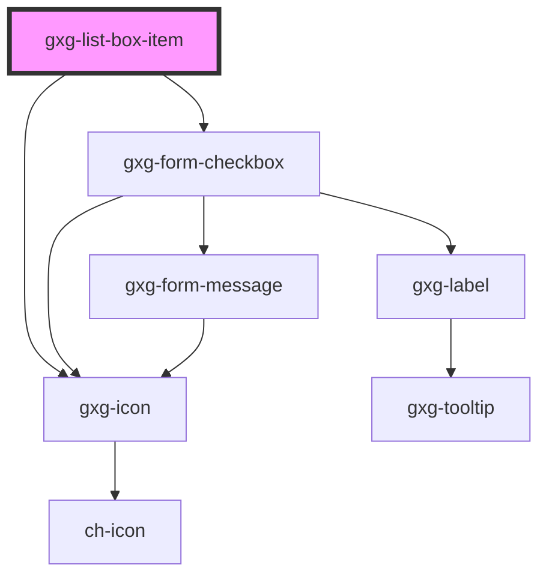

# gxg-listbox-item

<!-- Auto Generated Below -->

## Properties

| Property             | Attribute              | Description                                                                                                                    | Type      | Default     |
| -------------------- | ---------------------- | ------------------------------------------------------------------------------------------------------------------------------ | --------- | ----------- |
| `active`             | `active`               | The presence of this attribute sets this item as active (it is as if it was focused) Only one item at a time should be active. | `boolean` | `false`     |
| `checkbox`           | `checkbox`             | The presence of this attribute will add a checkbox to the item.                                                                | `boolean` | `false`     |
| `checked`            | `checked`              | The presence of this attribute will make the checkbox checked.                                                                 | `boolean` | `false`     |
| `disabled`           | `disabled`             | The presence of this attribute disabled the list-box-item                                                                      | `boolean` | `undefined` |
| `emitCheckboxChange` | `emit-checkbox-change` | The presence of this attribute emits the 'checkboxChanged' event every time a checkbox value is changed.                       | `boolean` | `false`     |
| `highlighted`        | `highlighted`          | The presence of this attribute sets this item as highlighted                                                                   | `boolean` | `false`     |
| `icon`               | `icon`                 | Any icon that belongs to Gemini icon library: https://gx-gemini.netlify.app/?path=/story/icons                                 | `string`  | `undefined` |
| `index`              | `index`                | This property is set by the list-box item. It should not be set by the user.                                                   | `number`  | `null`      |
| `lastSelected`       | `last-selected`        | This property is for internal use                                                                                              | `boolean` | `false`     |
| `selected`           | `selected`             | The presence of this attribute sets this item as selected                                                                      | `boolean` | `false`     |
| `value`              | `value`                | The item value. If value is not provided, the value will be the item innerHTML.                                                | `any`     | `undefined` |

## Events

| Event                  | Description                       | Type                                                                                                                            |
| ---------------------- | --------------------------------- | ------------------------------------------------------------------------------------------------------------------------------- |
| `checkboxStateChanged` | (This event is for internal use.) | `CustomEvent<{ checkedItem: HTMLGxgListBoxItemElement; checked: boolean; }>`                                                    |
| `itemClicked`          | (This event is for internal use.) | `CustomEvent<{ clickedItem: HTMLGxgListBoxItemElement; ctrlKey: boolean; cmdKey: boolean; shiftKey: boolean; index: number; }>` |
| `itemLoaded`           | (This event is for internal use.) | `CustomEvent<any>`                                                                                                              |
| `itemSelected`         | (This event is for internal use.) | `CustomEvent<any>`                                                                                                              |

## Dependencies

### Depends on

- [gxg-form-checkbox](../form-checkbox)
- [gxg-icon](../icon)

### Graph

---

_Built with [StencilJS](https://stenciljs.com/)_
