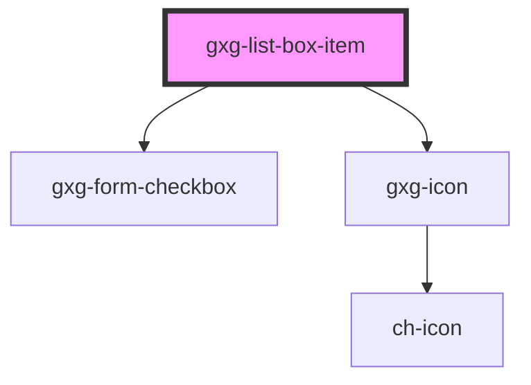

# gxg-listbox-item

<!-- Auto Generated Below -->

## Properties

| Property    | Attribute    | Description                                                                                    | Type                                                                                                                                                                                     | Default     |
| ----------- | ------------ | ---------------------------------------------------------------------------------------------- | ---------------------------------------------------------------------------------------------------------------------------------------------------------------------------------------- | ----------- |
| `icon`      | `icon`       | Any icon that belongs to Gemini icon library: https://gx-gemini.netlify.app/?path=/story/icons | `string`                                                                                                                                                                                 | `undefined` |
| `iconColor` | `icon-color` | (This prop is for internal use).                                                               | `"alwaysblack" \| "auto" \| "disabled" \| "error" \| "negative" \| "onbackground" \| "ondisabled" \| "primary-active" \| "primary-enabled" \| "primary-hover" \| "success" \| "warning"` | `"auto"`    |
| `index`     | `index`      | This property is set by the list-box item. It should not be set by the user.                   | `number`                                                                                                                                                                                 | `null`      |
| `selected`  | `selected`   | The presence of this attribute sets this item as selected                                      | `boolean`                                                                                                                                                                                | `false`     |
| `value`     | `value`      | The item value. If value is not provided, the value will be the item innerHTML.                | `any`                                                                                                                                                                                    | `undefined` |

## Events

| Event         | Description                       | Type               |
| ------------- | --------------------------------- | ------------------ |
| `itemClicked` | (This event is for internal use.) | `CustomEvent<any>` |
| `itemLoaded`  | (This event is for internal use.) | `CustomEvent<any>` |
| `KeyPressed`  | (This event is for internal use.) | `CustomEvent<any>` |

## Dependencies

### Depends on

- [gxg-form-checkbox](../form-checkbox)
- [gxg-icon](../icon)

### Graph

---

_Built with [StencilJS](https://stenciljs.com/)_
