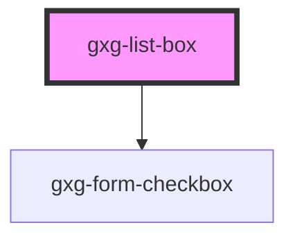

# gxg-listbox

<!-- Auto Generated Below -->

## Properties

| Property          | Attribute          | Description                                                            | Type      | Default   |
| ----------------- | ------------------ | ---------------------------------------------------------------------- | --------- | --------- |
| `checkboxes`      | `checkboxes`       | The prescence of this attribute will display a checkbox for every item | `boolean` | `false`   |
| `maxHeight`       | `max-height`       | The list-box max-height                                                | `string`  | `"none"`  |
| `maxWidth`        | `max-width`        | The list-box max-width                                                 | `string`  | `"none"`  |
| `minWidth`        | `min-width`        | The list-box min-width                                                 | `string`  | `"0"`     |
| `singleSelection` | `single-selection` | The prescence of this attribute will deactivate multi-selection        | `boolean` | `false`   |
| `theTitle`        | `the-title`        | The listbox title that appears on the header                           | `string`  | `""`      |
| `width`           | `width`            | The list-box width                                                     | `string`  | `"240px"` |

## Events

| Event              | Description                                                                                                                                                                                                                           | Type               |
| ------------------ | ------------------------------------------------------------------------------------------------------------------------------------------------------------------------------------------------------------------------------------- | ------------------ |
| `selectionChanged` | This event emmits the items that are currently selected. event.detail contains the selected items as objects. Each object contains the item idex and the item value. If value was not provided, the value will be the item innerText. | `CustomEvent<any>` |

## Methods

### `getSelectedItems() => Promise<any[]>`

#### Returns

Type: `Promise<any[]>`

## Dependencies

### Depends on

- [gxg-form-checkbox](../form-checkbox)

### Graph

---

_Built with [StencilJS](https://stenciljs.com/)_
