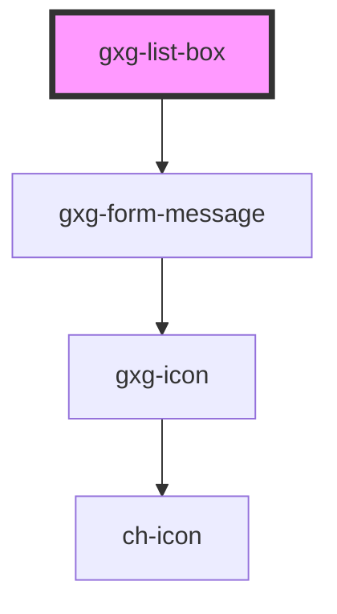

# gxg-listbox

<!-- Auto Generated Below -->

## Properties

| Property                   | Attribute                    | Description                                                                                                                                                    | Type                                                   | Default     |
| -------------------------- | ---------------------------- | -------------------------------------------------------------------------------------------------------------------------------------------------------------- | ------------------------------------------------------ | ----------- |
| `allowsNoSelection`        | `allows-no-selection`        | The presence of this attribute allows the list-box to not have any list-box-item selected                                                                      | `boolean`                                              | `false`     |
| `checkboxes`               | `checkboxes`                 | The presence of this attribute will display a checkbox for every item                                                                                          | `boolean`                                              | `false`     |
| `disabled`                 | `disabled`                   | The presence of this attribute makes the component disabled                                                                                                    | `boolean`                                              | `false`     |
| `displayValidationMessage` | `display-validation-message` | The presence of this attribute will display validation styles, such as a red, orange, or green border dependening on the validation status                     | `boolean`                                              | `false`     |
| `displayValidationStyles`  | `display-validation-styles`  | The presence of this attribute will display validation styles, such as a red, orange, or green border dependening on the validation status                     | `boolean`                                              | `false`     |
| `errorCondition`           | --                           | A function that will return true or false depending on wether the error condition is met or not                                                                | `Function`                                             | `undefined` |
| `height`                   | `height`                     | The list-box height                                                                                                                                            | `string`                                               | `"auto"`    |
| `informationMessage`       | `information-message`        | An informative message to help the user filling the information                                                                                                | `string`                                               | `undefined` |
| `maxWidth`                 | `max-width`                  | The list-box max-width                                                                                                                                         | `string`                                               | `"none"`    |
| `minWidth`                 | `min-width`                  | The list-box min-width                                                                                                                                         | `string`                                               | `"0"`       |
| `required`                 | `required`                   | Make the radio-buttons required                                                                                                                                | `boolean`                                              | `false`     |
| `singleSelection`          | `single-selection`           | The presence of this attribute will deactivate multi-selection                                                                                                 | `boolean`                                              | `false`     |
| `theTitle`                 | `the-title`                  | The listbox title that appears on the header                                                                                                                   | `string`                                               | `""`        |
| `validationMessage`        | `validation-message`         | The required message if this input is required and no value is provided (optional). If this is not provided, the default browser required message will show up | `string`                                               | `undefined` |
| `validationStatus`         | `validation-status`          | The validation status                                                                                                                                          | `"error" \| "indeterminate" \| "success" \| "warning"` | `undefined` |
| `warningCondition`         | --                           | A function that will return true or false depending on wether the warning condition is met or not                                                              | `Function`                                             | `undefined` |
| `width`                    | `width`                      | The list-box width                                                                                                                                             | `string`                                               | `"100%"`    |

## Events

| Event              | Description                                                                                                                                                                                                                          | Type               |
| ------------------ | ------------------------------------------------------------------------------------------------------------------------------------------------------------------------------------------------------------------------------------ | ------------------ |
| `selectionChanged` | This event emits the items that are currently selected. event.detail contains the selected items as objects. Each object contains the item idex and the item value. If value was not provided, the value will be the item innerText. | `CustomEvent<any>` |

## Methods

### `getSelectedItems() => Promise<any[]>`

#### Returns

Type: `Promise<any[]>`

### `validate() => Promise<boolean>`

---

METHODS

---

#### Returns

Type: `Promise<boolean>`

## Dependencies

### Depends on

- [gxg-form-message](../form-message)

### Graph

---

_Built with [StencilJS](https://stenciljs.com/)_
