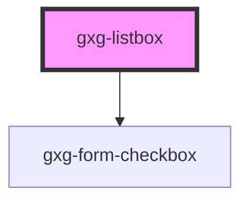

# gxg-listbox

<!-- Auto Generated Below -->

## Properties

| Property     | Attribute    | Description                                                            | Type      | Default   |
| ------------ | ------------ | ---------------------------------------------------------------------- | --------- | --------- |
| `checkboxes` | `checkboxes` | The prescence of this attribute will display a checkbox for every item | `boolean` | `false`   |
| `theTitle`   | `the-title`  | The listbox title that appears on the header                           | `string`  | `""`      |
| `width`      | `width`      | The listbox width                                                      | `string`  | `"280px"` |

## Events

| Event              | Description                                                                                                                                                                                                                           | Type               |
| ------------------ | ------------------------------------------------------------------------------------------------------------------------------------------------------------------------------------------------------------------------------------- | ------------------ |
| `selectionChanged` | This event emmits the items that are currently selected. event.detail contains the selected items as objects. Each object contains the item idex and the item value. If value was not provided, the value will be the item innerText. | `CustomEvent<any>` |

## Methods

### `getSelectedItems() => Promise<{ [x: number]: any; length: number; toString(): string; toLocaleString(): string; pop(): any; push(...items: any[]): number; concat(...items: ConcatArray<any>[]): any[]; concat(...items: any[]): any[]; join(separator?: string): string; reverse(): any[]; shift(): any; slice(start?: number, end?: number): any[]; sort(compareFn?: (a: any, b: any) => number): any[]; splice(start: number, deleteCount?: number): any[]; splice(start: number, deleteCount: number, ...items: any[]): any[]; unshift(...items: any[]): number; indexOf(searchElement: any, fromIndex?: number): number; lastIndexOf(searchElement: any, fromIndex?: number): number; every(callbackfn: (value: any, index: number, array: any[]) => unknown, thisArg?: any): boolean; some(callbackfn: (value: any, index: number, array: any[]) => unknown, thisArg?: any): boolean; forEach(callbackfn: (value: any, index: number, array: any[]) => void, thisArg?: any): void; map<U>(callbackfn: (value: any, index: number, array: any[]) => U, thisArg?: any): U[]; filter<S extends any>(callbackfn: (value: any, index: number, array: any[]) => value is S, thisArg?: any): S[]; filter(callbackfn: (value: any, index: number, array: any[]) => unknown, thisArg?: any): any[]; reduce(callbackfn: (previousValue: any, currentValue: any, currentIndex: number, array: any[]) => any): any; reduce(callbackfn: (previousValue: any, currentValue: any, currentIndex: number, array: any[]) => any, initialValue: any): any; reduce<U>(callbackfn: (previousValue: U, currentValue: any, currentIndex: number, array: any[]) => U, initialValue: U): U; reduceRight(callbackfn: (previousValue: any, currentValue: any, currentIndex: number, array: any[]) => any): any; reduceRight(callbackfn: (previousValue: any, currentValue: any, currentIndex: number, array: any[]) => any, initialValue: any): any; reduceRight<U>(callbackfn: (previousValue: U, currentValue: any, currentIndex: number, array: any[]) => U, initialValue: U): U; find<S extends any>(predicate: (this: void, value: any, index: number, obj: any[]) => value is S, thisArg?: any): S; find(predicate: (value: any, index: number, obj: any[]) => unknown, thisArg?: any): any; findIndex(predicate: (value: any, index: number, obj: any[]) => unknown, thisArg?: any): number; fill(value: any, start?: number, end?: number): any[]; copyWithin(target: number, start: number, end?: number): any[]; [Symbol.iterator](): IterableIterator<any>; entries(): IterableIterator<[number, any]>; keys(): IterableIterator<number>; values(): IterableIterator<any>; [Symbol.unscopables](): { copyWithin: boolean; entries: boolean; fill: boolean; find: boolean; findIndex: boolean; keys: boolean; values: boolean; }; includes(searchElement: any, fromIndex?: number): boolean; }>`

#### Returns

Type: `Promise<{ [x: number]: any; length: number; toString(): string; toLocaleString(): string; pop(): any; push(...items: any[]): number; concat(...items: ConcatArray<any>[]): any[]; concat(...items: any[]): any[]; join(separator?: string): string; reverse(): any[]; shift(): any; slice(start?: number, end?: number): any[]; sort(compareFn?: (a: any, b: any) => number): any[]; splice(start: number, deleteCount?: number): any[]; splice(start: number, deleteCount: number, ...items: any[]): any[]; unshift(...items: any[]): number; indexOf(searchElement: any, fromIndex?: number): number; lastIndexOf(searchElement: any, fromIndex?: number): number; every(callbackfn: (value: any, index: number, array: any[]) => unknown, thisArg?: any): boolean; some(callbackfn: (value: any, index: number, array: any[]) => unknown, thisArg?: any): boolean; forEach(callbackfn: (value: any, index: number, array: any[]) => void, thisArg?: any): void; map<U>(callbackfn: (value: any, index: number, array: any[]) => U, thisArg?: any): U[]; filter<S extends any>(callbackfn: (value: any, index: number, array: any[]) => value is S, thisArg?: any): S[]; filter(callbackfn: (value: any, index: number, array: any[]) => unknown, thisArg?: any): any[]; reduce(callbackfn: (previousValue: any, currentValue: any, currentIndex: number, array: any[]) => any): any; reduce(callbackfn: (previousValue: any, currentValue: any, currentIndex: number, array: any[]) => any, initialValue: any): any; reduce<U>(callbackfn: (previousValue: U, currentValue: any, currentIndex: number, array: any[]) => U, initialValue: U): U; reduceRight(callbackfn: (previousValue: any, currentValue: any, currentIndex: number, array: any[]) => any): any; reduceRight(callbackfn: (previousValue: any, currentValue: any, currentIndex: number, array: any[]) => any, initialValue: any): any; reduceRight<U>(callbackfn: (previousValue: U, currentValue: any, currentIndex: number, array: any[]) => U, initialValue: U): U; find<S extends any>(predicate: (this: void, value: any, index: number, obj: any[]) => value is S, thisArg?: any): S; find(predicate: (value: any, index: number, obj: any[]) => unknown, thisArg?: any): any; findIndex(predicate: (value: any, index: number, obj: any[]) => unknown, thisArg?: any): number; fill(value: any, start?: number, end?: number): any[]; copyWithin(target: number, start: number, end?: number): any[]; [Symbol.iterator](): IterableIterator<any>; entries(): IterableIterator<[number, any]>; keys(): IterableIterator<number>; values(): IterableIterator<any>; [Symbol.unscopables](): { copyWithin: boolean; entries: boolean; fill: boolean; find: boolean; findIndex: boolean; keys: boolean; values: boolean; }; includes(searchElement: any, fromIndex?: number): boolean; }>`

## Dependencies

### Depends on

- [gxg-form-checkbox](../form-checkbox)

### Graph

---

_Built with [StencilJS](https://stenciljs.com/)_
