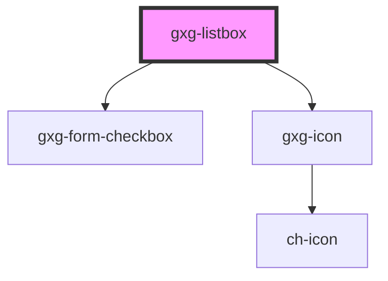

# gxg-listbox

<!-- Auto Generated Below -->

## Properties

| Property     | Attribute    | Description                                                                                       | Type       | Default     |
| ------------ | ------------ | ------------------------------------------------------------------------------------------------- | ---------- | ----------- |
| `checkboxes` | `checkboxes` | The prescence of this attribute will display a checkbox for every item                            | `boolean`  | `false`     |
| `items`      | --           | That array of items as objects. example: {icon: "objects/business-process-diagram", value: "BPM"} | `object[]` | `undefined` |
| `title`      | `title`      | The listbox title that appears on the header                                                      | `string`   | `""`        |
| `width`      | `width`      | The listbox width                                                                                 | `string`   | `"280px"`   |

## Events

| Event              | Description | Type               |
| ------------------ | ----------- | ------------------ |
| `selectionChanged` |             | `CustomEvent<any>` |

## Dependencies

### Depends on

- [gxg-form-checkbox](../form-checkbox)
- [gxg-icon](../icon)

### Graph

---

_Built with [StencilJS](https://stenciljs.com/)_
