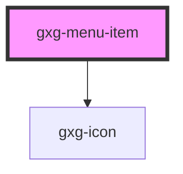

# todo-list

<!-- Auto Generated Below -->

## Properties

| Property | Attribute | Description | Type                                                                                                                                                                                                                                                                                                                                                                                                                                                    | Default     |
| -------- | --------- | ----------- | ------------------------------------------------------------------------------------------------------------------------------------------------------------------------------------------------------------------------------------------------------------------------------------------------------------------------------------------------------------------------------------------------------------------------------------------------------- | ----------- |
| `active` | `active`  |             | `boolean`                                                                                                                                                                                                                                                                                                                                                                                                                                               | `false`     |
| `icon`   | `icon`    |             | `"error" \| "success" \| "warning" \| "none" \| "add" \| "add-circle" \| "arrow-down" \| "arrow-left" \| "arrow-right" \| "arrow-up" \| "chevron-down" \| "chevron-left" \| "chevron-right" \| "chevron-up" \| "close" \| "color-picker" \| "deleted" \| "drag" \| "duplicate" \| "edit-wand" \| "edit" \| "empty" \| "level-down" \| "level-up" \| "more-info" \| "reset" \| "search" \| "settings" \| "show-more-horizontal" \| "show-more-vertical"` | `null`      |
| `label`  | `label`   |             | `string`                                                                                                                                                                                                                                                                                                                                                                                                                                                | `undefined` |

## Events

| Event            | Description | Type               |
| ---------------- | ----------- | ------------------ |
| `menuItemActive` |             | `CustomEvent<any>` |

## Dependencies

### Depends on

- [gxg-icon](../icon)

### Graph

---

_Built with [StencilJS](https://stenciljs.com/)_
