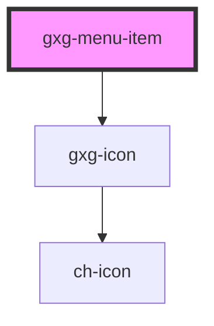

# todo-list

<!-- Auto Generated Below -->

## Properties

| Property   | Attribute   | Description                                                                                                                                  | Type      | Default     |
| ---------- | ----------- | -------------------------------------------------------------------------------------------------------------------------------------------- | --------- | ----------- |
| `active`   | `active`    | Sets the item as active or not                                                                                                               | `boolean` | `false`     |
| `disabled` | `disabled`  | Disables the item                                                                                                                            | `boolean` | `false`     |
| `ellipsis` | `ellipsis`  | Prevents the the text from wrapping into more than one line, adding an ellipsis at the end. This property is set and inherited one the menu. | `boolean` | `false`     |
| `iconType` | `icon-type` | The item iconType                                                                                                                            | `string`  | `undefined` |
| `itemId`   | `item-id`   | The item identifier                                                                                                                          | `string`  | `undefined` |
| `label`    | `label`     | The item label                                                                                                                               | `string`  | `undefined` |

## Events

| Event          | Description                                                               | Type                                                                                          |
| -------------- | ------------------------------------------------------------------------- | --------------------------------------------------------------------------------------------- |
| `itemSelected` | This events emits the item id, label, iconType, and a reference to itself | `CustomEvent<{ iconType?: string; id: string; label: string; ref: HTMLGxgMenuItemElement; }>` |

## Shadow Parts

| Part       | Description |
| ---------- | ----------- |
| `"button"` |             |
| `"icon"`   |             |
| `"item"`   |             |
| `"label"`  |             |

## Dependencies

### Depends on

- [gxg-icon](../icon)

### Graph

---

_Built with [StencilJS](https://stenciljs.com/)_
