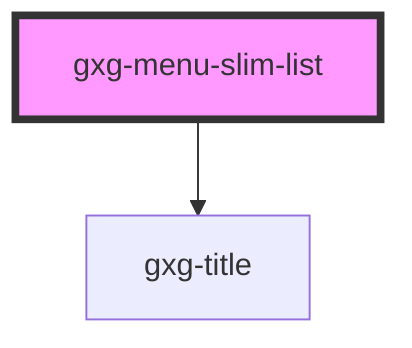

# gxg-menu-list

<!-- Auto Generated Below -->

## Properties

| Property    | Attribute    | Description         | Type     | Default     |
| ----------- | ------------ | ------------------- | -------- | ----------- |
| `listTitle` | `list-title` | The menu-list title | `string` | `undefined` |

## Shadow Parts

| Part              | Description |
| ----------------- | ----------- |
| `"list"`          |             |
| `"title"`         |             |
| `"title-wrapper"` |             |
| `"wrapper"`       |             |

## Dependencies

### Depends on

- [gxg-title](../../title)

### Graph

----------------------------------------------

*Built with [StencilJS](https://stenciljs.com/)*
