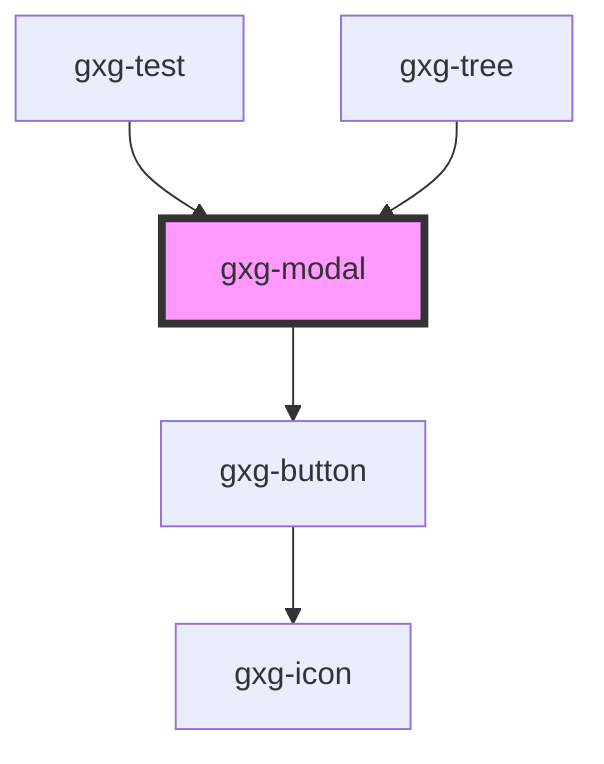

# gxg-modal

<h2>Notes</h2>
<ul>
   <li>To insert any html tag into the modal footer, use a <code>slot</code> attribute and assign the "footer" value to it. ie.: <code>&lt;button slot="footer"&gt;Save&lt;/button&gt;</code> This will ensure that the button is placed on the modal footer.</li>
</ul>

<!-- Auto Generated Below -->

## Properties

| Property               | Attribute                | Description                        | Type                                                          | Default      |
| ---------------------- | ------------------------ | ---------------------------------- | ------------------------------------------------------------- | ------------ |
| `footerJustifyContent` | `footer-justify-content` | The footer justify content type    | `string`                                                      | `"flex-end"` |
| `modalTitle`           | `modal-title`            | The modal title                    | `string`                                                      | `undefined`  |
| `padding`              | `padding`                |                                    | `"0" \| "l" \| "m" \| "s" \| "xl" \| "xs" \| "xxl" \| "xxxl"` | `"s"`        |
| `visible`              | `visible`                | Wether the modal is visible or not | `boolean`                                                     | `false`      |
| `width`                | `width`                  | The modal width                    | `string`                                                      | `"304px"`    |
| `zIndex`               | `z-index`                | The z-index value of the modal     | `string`                                                      | `"100"`      |

## Dependencies

### Used by

- [gxg-test](../test)
- [gxg-tree](../tree)

### Depends on

- [gxg-button](../button)

### Graph

---

_Built with [StencilJS](https://stenciljs.com/)_
