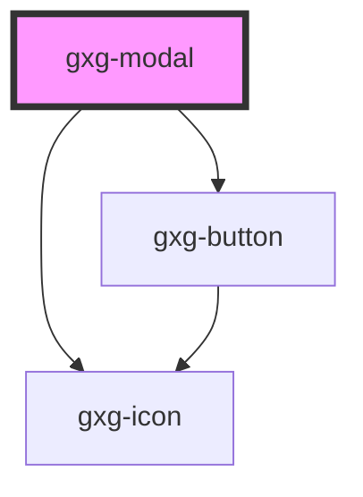

# gxg-template

<!-- Auto Generated Below -->

## Properties

| Property          | Attribute          | Description                        | Type                            | Default     |
| ----------------- | ------------------ | ---------------------------------- | ------------------------------- | ----------- |
| `footerAlignment` | `footer-alignment` | The footer alignment               | `"center" \| "left" \| "right"` | `"left"`    |
| `modalTitle`      | `modal-title`      | The modal title                    | `string`                        | `undefined` |
| `visible`         | `visible`          | Wether the modal is visible or not | `boolean`                       | `false`     |
| `width`           | `width`            | The modal width                    | `string`                        | `"304px"`   |
| `zIndex`          | `z-index`          | The z-index value of the modal     | `string`                        | `"10"`      |

## Dependencies

### Depends on

- [gxg-button](../button)
- [gxg-icon](../icon)

### Graph

---

_Built with [StencilJS](https://stenciljs.com/)_
