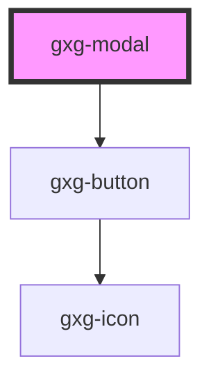

# gxg-modal

<!-- Auto Generated Below -->

## Properties

| Property     | Attribute     | Description                        | Type                                                   | Default     |
| ------------ | ------------- | ---------------------------------- | ------------------------------------------------------ | ----------- |
| `modalTitle` | `modal-title` | The modal title                    | `string`                                               | `undefined` |
| `padding`    | `padding`     |                                    | `"l" \| "m" \| "s" \| "xl" \| "xs" \| "xxl" \| "xxxl"` | `"s"`       |
| `visible`    | `visible`     | Wether the modal is visible or not | `boolean`                                              | `false`     |
| `width`      | `width`       | The modal width                    | `string`                                               | `"304px"`   |
| `zIndex`     | `z-index`     | The z-index value of the modal     | `string`                                               | `"10"`      |

## Dependencies

### Depends on

- [gxg-button](../button)

### Graph

---

_Built with [StencilJS](https://stenciljs.com/)_
