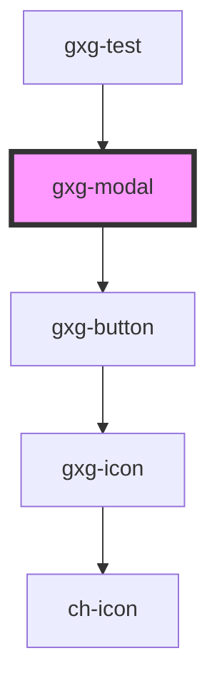

# gxg-modal

<h2>Notes</h2>
<ul>
   <li>To insert any html tag into the modal footer, use a <code>slot</code> attribute and assign the "footer" value to it. ie.: <code>&lt;button slot="footer"&gt;Save&lt;/button&gt;</code> This will ensure that the button is placed on the modal footer.</li>
</ul>

<!-- Auto Generated Below -->

## Properties

| Property               | Attribute                | Description                                                                        | Type                                                          | Default      |
| ---------------------- | ------------------------ | ---------------------------------------------------------------------------------- | ------------------------------------------------------------- | ------------ |
| `flavor`               | `flavor`                 |                                                                                    | `"alternate" \| "classic"`                                    | `"classic"`  |
| `footerJustifyContent` | `footer-justify-content` | The footer justify content type                                                    | `string`                                                      | `"flex-end"` |
| `hideFooter`           | `hide-footer`            | The presence of this attribute hides the footer.                                   | `boolean`                                                     | `false`      |
| `maxWidth`             | `max-width`              | The modal max-width                                                                | `string`                                                      | `"300px"`    |
| `modalTitle`           | `modal-title`            | The modal title                                                                    | `string`                                                      | `undefined`  |
| `padding`              | `padding`                |                                                                                    | `"0" \| "l" \| "m" \| "s" \| "xl" \| "xs" \| "xxl" \| "xxxl"` | `"s"`        |
| `silent`               | `silent`                 | The presence of this attribute removes the sound that plays when the modal appears | `boolean`                                                     | `false`      |
| `visible`              | `visible`                | Wether the modal is visible or not                                                 | `boolean`                                                     | `false`      |
| `width`                | `width`                  | The modal width                                                                    | `string`                                                      | `"100%"`     |
| `zIndex`               | `z-index`                | The z-index value of the modal                                                     | `string`                                                      | `"100"`      |

## Events

| Event         | Description                       | Type               |
| ------------- | --------------------------------- | ------------------ |
| `modalClosed` | Emmited when the modal was closed | `CustomEvent<any>` |
| `modalOpened` | Emmited when the modal was opened | `CustomEvent<any>` |

## Methods

### `close() => Promise<void>`

#### Returns

Type: `Promise<void>`

## Dependencies

### Used by

- [gxg-test](../test)

### Depends on

- [gxg-button](../button)

### Graph

---

_Built with [StencilJS](https://stenciljs.com/)_
