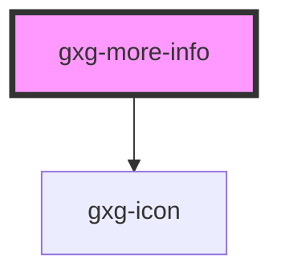

# gxg-tooltip

<!-- Auto Generated Below -->

## Properties

| Property   | Attribute  | Description          | Type                                     | Default     |
| ---------- | ---------- | -------------------- | ---------------------------------------- | ----------- |
| `label`    | `label`    | The label            | `string`                                 | `undefined` |
| `position` | `position` | the tooltip position | `"bottom" \| "left" \| "right" \| "top"` | `"top"`     |

## Dependencies

### Depends on

- [gxg-icon](../icon)

### Graph

---

_Built with [StencilJS](https://stenciljs.com/)_
