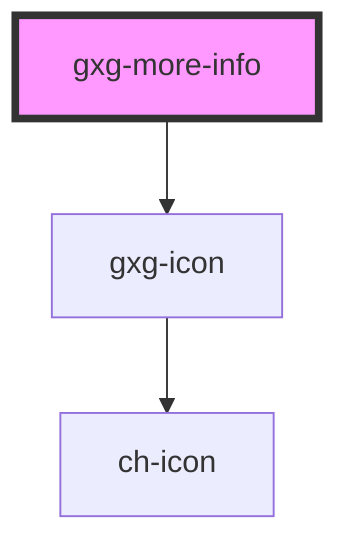

# gxg-tooltip

<!-- Auto Generated Below -->

## Properties

| Property        | Attribute         | Description                                                                     | Type                                     | Default       |
| --------------- | ----------------- | ------------------------------------------------------------------------------- | ---------------------------------------- | ------------- |
| `label`         | `label`           | The label                                                                       | `string`                                 | `undefined`   |
| `moreInfoLabel` | `more-info-label` | (Optional) The "more-info" label. This property goes along with "url" attribute | `string`                                 | `"more info"` |
| `position`      | `position`        | the tooltip position                                                            | `"bottom" \| "left" \| "right" \| "top"` | `"top"`       |
| `target`        | `target`          | The url target                                                                  | `"_blank" \| "self"`                     | `"_blank"`    |
| `url`           | `url`             | (Optional) The "more-info" url.                                                 | `string`                                 | `null`        |

## Dependencies

### Depends on

- [gxg-icon](../icon)

### Graph

----------------------------------------------

*Built with [StencilJS](https://stenciljs.com/)*
