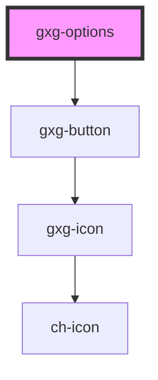

# gxg-options

<!-- Auto Generated Below -->

## Properties

| Property            | Attribute             | Description | Type                | Default  |
| ------------------- | --------------------- | ----------- | ------------------- | -------- |
| `maxVisibleOptions` | `max-visible-options` |             | `number`            | `6`      |
| `maxWidth`          | `max-width`           |             | `string`            | `"100%"` |
| `position`          | `position`            |             | `"left" \| "right"` | `"left"` |
| `width`             | `width`               |             | `string`            | `"100%"` |
| `zIndex`            | `z-index`             |             | `string`            | `"10"`   |

## Dependencies

### Depends on

- [gxg-button](../button)

### Graph

---

_Built with [StencilJS](https://stenciljs.com/)_
