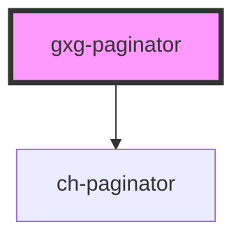

# gxg-paginator

<!-- Auto Generated Below -->

## Properties

| Property     | Attribute     | Description | Type     | Default     |
| ------------ | ------------- | ----------- | -------- | ----------- |
| `activePage` | `active-page` |             | `number` | `undefined` |
| `totalPages` | `total-pages` |             | `number` | `undefined` |

## Dependencies

### Depends on

- ch-paginator

### Graph

---

_Built with [StencilJS](https://stenciljs.com/)_
