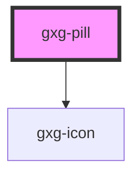

# gxg-pill

<!-- Auto Generated Below -->

## Properties

| Property   | Attribute  | Description                                                                           | Type                                                                                                                                                                                                                                                                                                                                                                                                                                                                                                                                                       | Default         |
| ---------- | ---------- | ------------------------------------------------------------------------------------- | ---------------------------------------------------------------------------------------------------------------------------------------------------------------------------------------------------------------------------------------------------------------------------------------------------------------------------------------------------------------------------------------------------------------------------------------------------------------------------------------------------------------------------------------------------------- | --------------- |
| `disabled` | `disabled` | The presence of this attribute disables the pillgit a                                 | `boolean`                                                                                                                                                                                                                                                                                                                                                                                                                                                                                                                                                  | `false`         |
| `icon`     | `icon`     | The icon                                                                              | `"error" \| "success" \| "warning" \| "none" \| "add" \| "add-circle" \| "arrow-down" \| "arrow-left" \| "arrow-right" \| "arrow-up" \| "chevron-down" \| "chevron-left" \| "chevron-right" \| "chevron-up" \| "circle" \| "close" \| "color-picker" \| "deleted" \| "drag" \| "duplicate" \| "edit" \| "edit-wand" \| "empty" \| "file" \| "folder" \| "level-down" \| "level-up" \| "minus" \| "minus-circle" \| "more-info" \| "pill-filled" \| "pill-outlined" \| "reset" \| "search" \| "settings" \| "show-more-horizontal" \| "show-more-vertical"` | `"pill-filled"` |
| `label`    | `label`    | The label                                                                             | `string`                                                                                                                                                                                                                                                                                                                                                                                                                                                                                                                                                   | `undefined`     |
| `type`     | `type`     | The presence of this attribute ads a close button that when clicked, removes the pill | `"button" \| "button-with-action" \| "static"`                                                                                                                                                                                                                                                                                                                                                                                                                                                                                                             | `"static"`      |

## Dependencies

### Depends on

- [gxg-icon](../icon)

### Graph

---

_Built with [StencilJS](https://stenciljs.com/)_
