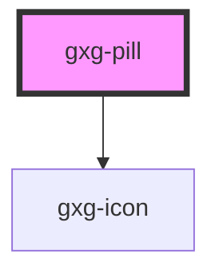

# gxg-pill

<!-- Auto Generated Below -->

## Properties

| Property   | Attribute  | Description                                                                           | Type                                                                   | Default                 |
| ---------- | ---------- | ------------------------------------------------------------------------------------- | ---------------------------------------------------------------------- | ----------------------- |
| `disabled` | `disabled` | The presence of this attribute disables the pillgit a                                 | `boolean`                                                              | `false`                 |
| `icon`     | `icon`     | The icon                                                                              | `"general/pill-filled" \| "general/pill-outlined"`                     | `"general/pill-filled"` |
| `type`     | `type`     | The presence of this attribute ads a close button that when clicked, removes the pill | `"button" \| "button-with-action" \| "static" \| "static-with-action"` | `"static"`              |

## Dependencies

### Depends on

- [gxg-icon](../icon)

### Graph

---

_Built with [StencilJS](https://stenciljs.com/)_
