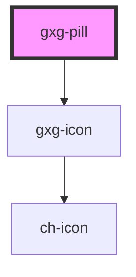

# gxg-pill

<!-- Auto Generated Below -->

## Properties

| Property     | Attribute     | Description                                                                       | Type                                                                   | Default     |
| ------------ | ------------- | --------------------------------------------------------------------------------- | ---------------------------------------------------------------------- | ----------- |
| `disabled`   | `disabled`    | The presence of this attribute disables the pillgit a                             | `boolean`                                                              | `false`     |
| `heightAuto` | `height-auto` | The presence of this attribute sets auto-height. Usefull when the text overflows. | `boolean`                                                              | `false`     |
| `icon`       | `icon`        | The icon                                                                          | `string`                                                               | `undefined` |
| `type`       | `type`        | The type of pill                                                                  | `"button" \| "button-with-action" \| "static" \| "static-with-action"` | `"static"`  |

## Dependencies

### Depends on

- [gxg-icon](../icon)

### Graph

---

_Built with [StencilJS](https://stenciljs.com/)_
