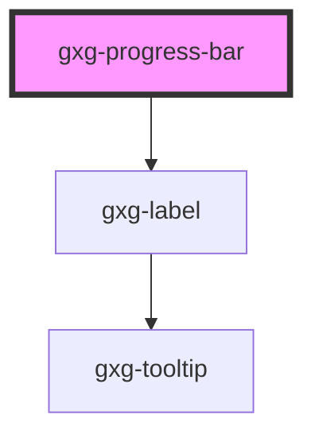

# gxg-progress-bar

<!-- Auto Generated Below -->

## Properties

| Property   | Attribute   | Description                                                                                | Type      | Default   |
| ---------- | ----------- | ------------------------------------------------------------------------------------------ | --------- | --------- |
| `disabled` | `disabled`  | The state of the progress-bar, whether it is disabled or not.                              | `boolean` | `false`   |
| `label`    | `label`     | The progress-bar label                                                                     | `string`  | `"Label"` |
| `maxWidth` | `max-width` | The max. width                                                                             | `string`  | `"100%"`  |
| `silent`   | `silent`    | The presence of this attribute removes the sound that plays when the progress-bar finishes | `boolean` | `false`   |
| `value`    | `value`     | The progress value (percentage)                                                            | `number`  | `0`       |

## Dependencies

### Depends on

- [gxg-label](../label)

### Graph

---

_Built with [StencilJS](https://stenciljs.com/)_
