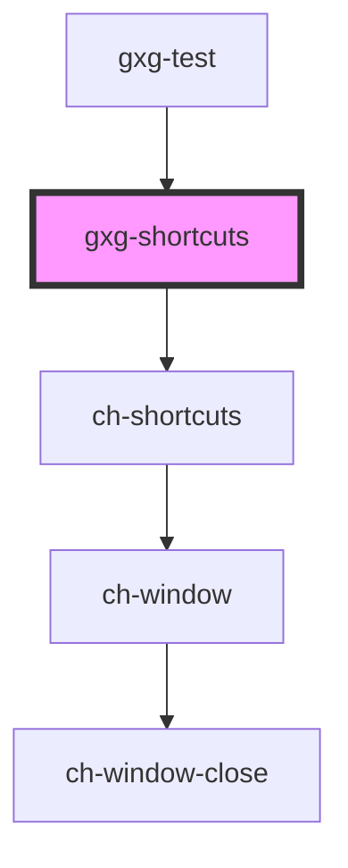

# gxg-shortcuts

<!-- Auto Generated Below -->

## Properties

| Property           | Attribute      | Description                          | Type      | Default     |
| ------------------ | -------------- | ------------------------------------ | --------- | ----------- |
| `showKey`          | `show-key`     |                                      | `"F10"`   | `"F10"`     |
| `showTooltip`      | `show-tooltip` |                                      | `boolean` | `false`     |
| `src` _(required)_ | `src`          | The URL of the shortcut definitions. | `string`  | `undefined` |
| `suspend`          | `suspend`      |                                      | `boolean` | `false`     |

## Dependencies

### Used by

- [gxg-test](../test)

### Depends on

- ch-shortcuts

### Graph

---

_Built with [StencilJS](https://stenciljs.com/)_
